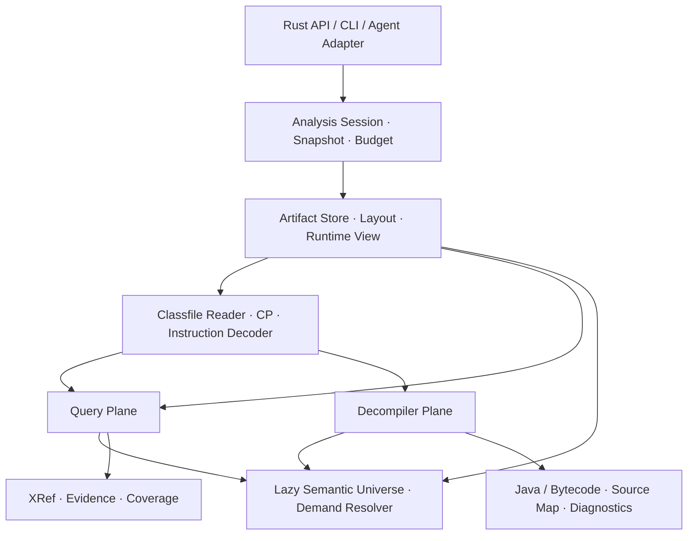
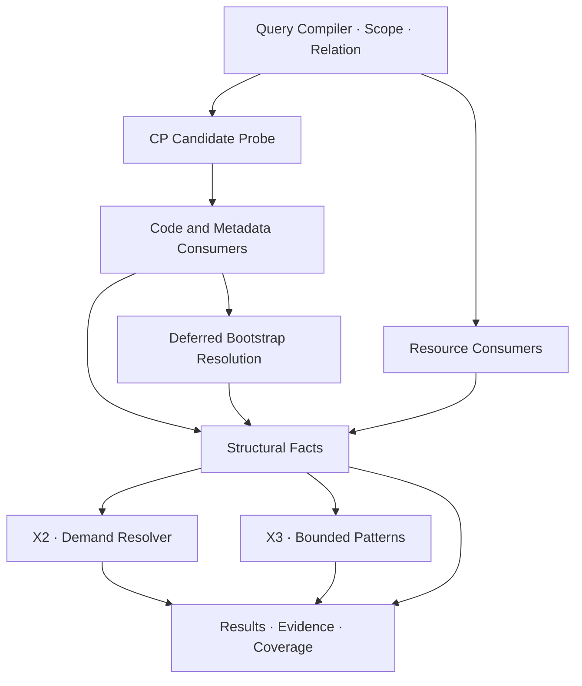
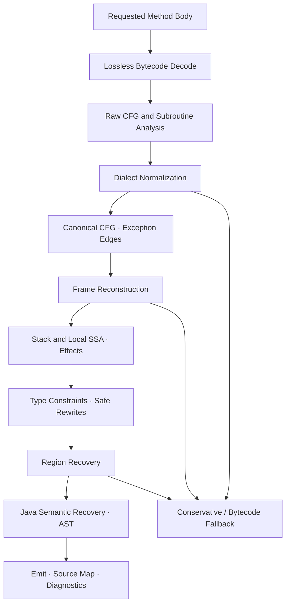

# 纯 Rust JVM 静态分析与按需反编译引擎：最终架构

> 版本：1.0 · 架构基线  
> 整理与规范核对日期：2026-09-16  
> 交付定位：可用于实现拆分、接口设计和评审的技术设计；本文不是已实现能力或实测性能报告。  
> 核心目标：独立、纯 Rust、library-first，原生处理 `.class`、`.jar`、`.war`；无需 JVM/JADX 运行依赖，支持直接查询 artifact、精确结构引用和按需 Java 反编译。

## 目录

1. [目标与最终决策](#s01)
2. [架构不变量](#s02)
3. [整体架构与模块边界](#s03)
4. [版本体系与 Java 8 兼容基线](#s04)
5. [Artifact、容器布局与 Runtime View](#s05)
6. [按需物化与物理 I/O 边界](#s06)
7. [Classfile Reader 与共享解码底座](#s07)
8. [身份、符号与证据模型](#s08)
9. [Query Plane 与 XRef 正确性契约](#s09)
10. [Lazy Semantic Universe 与 Demand Resolver](#s10)
11. [Decompiler Plane 与 IR 管线](#s11)
12. [Java 语义恢复与历史编译器差异](#s12)
13. [输出、降级和源码映射](#s13)
14. [Phase、Pass 与扩展机制](#s14)
15. [Rust API 与调用方式](#s15)
16. [缓存、并发、取消与快照](#s16)
17. [不可信输入与资源预算](#s17)
18. [性能模型与优化次序](#s18)
19. [关键 Challenge 与解决方案](#s19)
20. [验证体系与发布门槛](#s20)
21. [实施阶段与依赖顺序](#s21)
22. [本次纠正、补充与 ADR](#s22)
23. [规范与项目参考](#s23)

<a id="s01"></a>
## 1. 目标与最终决策

### 1.1 产品定义

实现一个以 Rust crate 为主要交付形式的 JVM artifact 分析引擎。调用方可以只打开一个 JAR 搜索字符串/类型/成员引用，也可以只反编译某个类或方法；不要求先建立全程序对象图、全局 XRef 数据库或反编译全部依赖。

保留两项核心思想：

- **Artifact as database**：编译产物本身就是可查询的数据源；索引是可选加速器。
- **Demand-driven reconstruction**：只有请求需要时才构造 Header、方法 Body、IR 和 Java 输出，并限制其依赖闭包。

借鉴 ASC 的按需检索与局部重建思想，借鉴 JADX 的多阶段反编译组织方式，但独立实现 JVM 栈机语义和 Rust 对象模型。ASC 官方仓库当前定位为 Android 反编译前端；其 DEX/R8 布局优化和性能数据不能直接移植为本项目的 JVM 能力承诺。[ASC 项目](https://github.com/MG1937/ASC)

### 1.2 范围

| 维度 | 最终范围 |
| --- | --- |
| 实现形态 | 纯 Rust 引擎库；CLI、Agent/MCP、服务接口为外层适配器 |
| 必须输入 | 单独 CLASS、标准 JAR、WAR、混合版本依赖 |
| 常见打包 | Spring Boot JAR/WAR；通用嵌套 ZIP 容器能力 |
| 查询 | 符号/字面量搜索、结构 XRef、按需解析、可选动态模式分析 |
| 反编译 | 方法、类、源文件单元三个粒度；默认只扩展最小必要闭包 |
| 兼容基线 | Java 8 Runtime Profile，包含历史 classfile 的明确支持和降级策略 |
| 演进范围 | classfile 45–71 的版本建模，按逐项能力矩阵验收；后续通过 Registry 扩展 |
| 输出 | 类型化 Rust 结果、可序列化结果、Java 文本、字节码回退、证据与覆盖范围 |
| 非必需 | 全局预索引、JVM 安装、远程依赖下载、持久数据库、GUI |
| 暂不作为核心目标 | DEX/APK、还原 Kotlin/Scala 原始源码、执行目标代码、完整 whole-program call graph、通用源码降级编译器 |

“没有 JVM 运行依赖”不等于“解析 Java 平台类型时无需平台定义”。平台 class headers 由调用方提供或由显式配置的数据集提供；测试环境可以使用 JDK。

### 1.3 四个必须区分的承诺

1. **可解析**：能够安全识别文件结构和指令。
2. **可提取事实**：能够在声明的 consumer 集合内返回结构引用。
3. **可恢复源码**：能够输出某一质量等级的 Java 表达。
4. **可在指定 JVM 运行**：取决于平台、加载器、依赖和运行环境；静态引擎只能做有范围的兼容诊断。

这四项不能合并为一个 `supported = true`。

<a id="s02"></a>
## 2. 架构不变量

| 编号 | 不变量 | 直接后果 |
| --- | --- | --- |
| I1 | Query 不依赖 Decompiler | X0/X1 不构造 CFG、SSA、Region 或 Java AST |
| I2 | Decompiler 不依赖全局 XRef | 单方法请求不先扫描所有方法体 |
| I3 | 原始 artifact 是事实来源 | 恢复、去糖、重命名不覆盖原始引用 |
| I4 | 符号引用、定义解析、运行时派发分离 | `mentions_symbol`、`resolves_to`、`may_dispatch_to` 是不同关系 |
| I5 | 没有 mandatory whole-program load | 允许按需扫描全部 Header，但不强制物化全部 Body/IR |
| I6 | 依赖默认只到 Header | 升级 Body 必须有具体分析需求和预算 |
| I7 | 缓存只是 accelerator | 完整执行时冷/热缓存结果一致；预算中断状态显式返回 |
| I8 | 每个结果携带 provenance | 至少能定位到物理 entry 与 Code BCI、attribute 路径或 resource 位置 |
| I9 | 不执行被分析代码 | 不调用 bootstrap、类初始化器、JNI、反射或目标 classloader |
| I10 | 缺失、歧义、失败不能伪装为否定 | “未发现”必须同时报告范围与覆盖状态 |
| I11 | 复杂恢复可降级 | 保留可验证事实，允许 Conservative/Bytecode 输出 |
| I12 | 所有扩展工作有预算 | 容器递归、解析、闭包、IR 和输出均可限制和取消 |

<a id="s03"></a>
## 3. 整体架构与模块边界



图中的共享服务不构成相互启动关系：X1 无需调用 Resolver；X2、X3 才按需调用。Decompiler 可以调用 Resolver，但不能隐式调用全局 XRef 构建。

### 3.1 建议模块

下表是逻辑边界；第一阶段可合并为少量 workspace crates，不必为每层提前建立独立发布包。

| 模块 | 责任 | 不承担的责任 |
| --- | --- | --- |
| `artifact` | ByteSource、ZIP/ZIP64、嵌套容器、Layout、物理快照 | Java AST、类加载执行 |
| `classfile` | CP、Header、attributes、descriptor/signature、instruction cursor | 全局解析、源码生成 |
| `model` | ID、SymbolRef、UseSite、Evidence、Coverage、Diagnostics | 文件 I/O 和调度策略 |
| `universe` | Runtime View、平台数据、Header 提供、按需定义解析 | 必须存在的全程序图 |
| `query` | Query 编译、候选过滤、consumer 扫描、可选模式分析 | 反编译作为 XRef 前置步骤 |
| `ir` | 原始方法、规范化 CFG、Frame/SSA、Types、Effects、Regions | 源码文本管理 |
| `decompile` | Phase/Pass、恢复、最小闭包、降级协调 | ZIP 格式实现 |
| `java` | Java AST、命名、表达式优先级、格式化、源码映射 | 覆盖 artifact 事实 |
| `engine` | Session、公共 API、预算、缓存与任务执行 | 框架私有规则 |
| `adapters` | CLI、JSON、MCP/服务等薄封装 | 另一套分析语义 |

共用一套 instruction boundary decoder，避免 Query 和 Decompiler 对 `wide`、switch 等指令长度产生分歧。Query 使用无对象或轻量 cursor；Decompiler 选择将相同解码事件物化为 IR。

### 3.2 与 JADX 的关系

JADX 的公开 API 实现存在 RootNode、加载阶段和后续反编译调度等组织方式；本项目借鉴阶段划分和算法问题分解，不复制以全局可变节点为核心的对象图。[JADX API 实现](https://github.com/skylot/jadx/blob/master/jadx-core/src/main/java/jadx/api/JadxDecompiler.java)

JVM 是操作数栈模型，不能把 DEX 的寄存器模型直接当输入 IR。必须先处理 JVM Frame、异常边、构造器未初始化值、category-2 值和历史子程序，再进入统一的值/控制流分析。

<a id="s04"></a>
## 4. 版本体系与 Java 8 兼容基线

### 4.1 四个正交维度，外加一个启发式配置

| 概念 | 回答的问题 | 示例 |
| --- | --- | --- |
| `ClassfileDialect` | 这些字节怎样解读、哪些结构合法？ | `major=52, minor=0` |
| `RuntimeProfile / RuntimeView` | 在何种 Java/加载规则下选中哪些定义？ | Java 8、Java 17、Boot launch mode |
| `PlatformUniverse` | 解析时使用哪组平台类和依赖定义？ | 某个 JDK 8 的 `rt.jar` headers |
| `JavaOutputLevel` | 允许生成哪些 Java 源码语法？ | Java 8、17、21 |
| `RecoveryProfile` | 尝试哪些编译器模式恢复？ | javac 8、ECJ、Unknown |

`RecoveryProfile` 是启发式，不决定文件合法性、结构 XRef 或基础控制流。编译器来源未知时使用 generic JVM fallback。

Java 8 Runtime View 只选择其模型下可见的定义；物理查询仍应能看见包内不兼容或未激活的高版本 class。由此，**先枚举物理 artifact，再建立运行视图**，不能先用 Runtime Profile 把物理证据丢弃。

### 4.2 Java 8 是完整的目标配置

Java 8 输入可能混合 Java 5、6、7、8 的编译产物。因此基线必须包含历史格式、旧编译器模式、无调试信息、lambda 和 interface default/static methods。Java 8 规范描述的 classfile 支持范围上界为 52.0；历史 minor 规则必须按该版本规范检查，不可写成“所有 major 的 minor 都必须为 0”。[JVMS 8 §4.1](https://docs.oracle.com/javase/specs/jvms/se8/html/jvms-4.html#jvms-4.1)

版本兼容检查分三步：

1. Reader 能否识别结构；
2. 该结构是否符合 classfile 自身 dialect；
3. 选定 Runtime Profile 是否接受该 dialect 及其所需平台能力。

静态解析成功不能作为 JVM verifier 验证通过的替代证明。

### 4.3 Feature Registry

| 世代 | major | 应重点覆盖的特性 |
| --- | ---: | --- |
| 早期 Java–1.4 | 45–48 | 历史 minor 规则、`jsr/jsr_w/ret`、旧 finally |
| Java 5 | 49 | Signature、annotations、enum 与 bridge 模式 |
| Java 6 | 50 | StackMapTable、历史 verifier 特殊情况 |
| Java 7 | 51 | MethodHandle、MethodType、InvokeDynamic、BootstrapMethods |
| Java 8 | 52 | Type annotations、MethodParameters、lambda、interface default/static |
| Java 9 | 53 | Module/Package CP、模块属性、interface private 方法 |
| Java 11 | 55 | ConstantDynamic、nestmates |
| Java 12+ | 56+ | preview minor 规则与版本绑定 |
| Java 16/17 | 60/61 | 正式 Record / PermittedSubclasses；更早 preview 单独建模 |
| Java 21/25/26/27 | 65/69/70/71 | 根据对应规范增量登记；不能只提升允许的 major 上限 |

Java 27 已于 2026-09-15 GA；其 classfile major 为 71。本文件将 71 作为当前设计覆盖上界，而非宣称所有 Java 27 源码恢复已实现。[OpenJDK 27](https://openjdk.org/projects/jdk/27/)、[Java 27 ClassFile 常量](https://docs.oracle.com/en/java/javase/27/docs/api/new-list.html)

Registry 至少记录 CP tag、attribute 合法位置/版本/基数、flags、opcode 约束及对应测试。Preview 支持必须绑定具体 release 和已实现特性；不能把旧版本的 `65535` preview class 当成新 JVM 普通 class。[现代 classfile 版本规则](https://docs.oracle.com/en/java/javase/26/docs/specs/jvms/jvms-4.html#jvms-4.1)

### 4.4 平台与输出不能偷换

- 解析 Java 8 artifact 时，不默认使用宿主机最新 JDK 的类定义。
- 平台输入可来自显式选择的 `rt.jar`、模块化 JDK 的 JMOD、预生成 Header 数据集；JRT image、`ct.sym` 等需要各自适配，不能当成普通等价 JAR。
- 平台缺失时保留 SymbolRef 和 MissingDependency；不要伪造平台方法。
- 把 Java 17 class 输出成 Java 8 语法不是一个开关能保证的功能。Record、sealed、现代 bootstrap 或 API 可能无法等价降级；返回 `OutputLevelConflict` 或保守输出。
- `PlatformUniverse` 指纹、Runtime View 和 Output Level 都进入相应缓存键。

<a id="s05"></a>
## 5. Artifact、容器布局与 Runtime View

### 5.1 Container 与 Layout 分离

Container 负责字节定位；Layout 负责“哪些 entry 构成类路径根、库、资源与启动元数据”。建议内建：

| Layout | 应用类位置 | 依赖位置 | 必须记录的差异 |
| --- | --- | --- | --- |
| `SingleClassLayout` | 单个 CLASS | 外部配置 | 路径不一定等于类内部名称 |
| `StandardJarLayout` | 归档根 | 外部 classpath / Manifest | JAR 内的任意嵌套 JAR 不自动激活 |
| `WarLayout` | `WEB-INF/classes` | `WEB-INF/lib` | Servlet 容器加载规则是配置，不是统一常量 |
| `SpringBootJarLayout` | `BOOT-INF/classes` | `BOOT-INF/lib` | 启动类、classpath index、外部 loader 配置 |
| `SpringBootWarLayout` | `WEB-INF/classes` | `WEB-INF/lib`、`WEB-INF/lib-provided` | executable 与 deployed 模式下的可见性不同 |

Spring Boot 的嵌套布局及 `classpath.idx` 会影响类路径解释；`layers.idx` 用于镜像分层，不应误当成运行时类路径顺序。[Spring Boot 嵌套归档规范](https://docs.spring.io/spring-boot/specification/executable-jar/nested-jars.html)

布局识别综合目录、Manifest 和配置证据，返回识别置信/冲突信息。用户显式配置优先；多个布局候选未能消歧时保留候选，不能静默选择一个“像是”的启动模型。

### 5.2 物理访问模式

| 嵌套 entry 状态 | 子容器访问 | 成本与约束 |
| --- | --- | --- |
| 外层 entry 为 STORED | `SeekableSubcontainer`，可映射到父容器字节区间 | 内层 class entry 仍可能压缩 |
| 外层 entry 为 DEFLATED | `MaterializedSubcontainer` | 先在预算内解压到内存或临时 backing file，再读取内层目录 |
| 仅顺序流输入 | 显式 spool 或顺序扫描 | 不承诺随机访问；报告物化成本 |
| 加密/未知压缩方法 | Unsupported | 不返回空容器冒充成功 |

Spring Boot 规定嵌套 JAR 的外层 ZIP entry 使用 STORED，以便直接定位内部内容；这不意味着内层文件没有压缩。[Spring Boot 归档限制](https://docs.spring.io/spring-boot/specification/executable-jar/restrictions.html)

保存原始 entry 名与规范化显示名。重复 ZIP entry、路径不一致、中央目录与局部头冲突要形成诊断；身份使用 entry ordinal/稳定 locator，不能用路径字符串覆盖重复项。ZIP64、data descriptor、前置启动脚本等格式差异属于容器层。

### 5.3 MR-JAR：Physical View 与 Runtime View

**Physical View** 返回所有 entry，包括 root 和 `META-INF/versions/N`。**Runtime View** 在声明的标准/自定义加载模型中选择定义，保留未选中项及原因。

对标准 MR-JAR 模型，`Multi-Release: true` 生效且目标 Java ≥9 时，按最高的 `N <= target` 选择变体，然后回退 root；Java 8 不通过 MR 机制选择版本目录。MR 也涉及资源，但 `META-INF` 下资源不能按普通 MR 资源规则版本化。[JAR 规范：Multi-release](https://docs.oracle.com/en/java/javase/26/docs/specs/jar/jar.html#multi-release-jar-files)

例：某 JAR 同时具有 root `Foo.class`、versions/11/Foo、versions/17/Foo。

| 运行视图 | 选中定义 |
| --- | --- |
| Java 8–10 | root |
| Java 11–16 | versions/11 |
| Java 17+ | versions/17，直到存在更高适用覆盖版本 |

如果仅 versions/11 中存在对 `Runtime.exec` 的引用，其 MR 选择区间可记为 `[11,17)`。这表示**该定义的选择条件**，不证明方法会执行，也不保证应用在整个区间可运行。

`RuntimeMatrix` 对有限的 Runtime Profiles 批量生成视图，并共享物理扫描。只有选择函数在区间内稳定时，才合并成区间；module/classpath、loader policy、平台和外部依赖变化需纳入条件。

MR 合规性检查与变体选择分离。版本目录名、classfile 版本、公开 API 等违规需要报告；不能把“JAR 作者应满足规范”作为丢弃样本的依据。标准 boot class path 等例外通过 Profile 表达。

### 5.4 类加载领域

`LoadDomain` 至少包含 loader 身份、父/子委派策略、有序 classpath/module roots、模块配置与外部覆盖规则。Loader identity 才是 JVM 类型身份的重要组成部分；module 是解析/访问上下文，不能替代 loader。[JVMS：类创建与解析](https://docs.oracle.com/en/java/javase/26/docs/specs/jvms/jvms-5.html#jvms-5.3)

未知的应用服务器、OSGi、自定义 classloader 或 agent transformation 返回 `UnknownLoaderPolicy` / `RuntimeTransformationPossible`，不宣称一个静态 root 顺序就等价真实运行时。

Manifest 的 Class-Path 只形成依赖声明与解析请求；默认不自动联网、也不越过调用方授权的本地 artifact 范围。

<a id="s06"></a>
## 6. 按需物化与物理 I/O 边界

保留 Materialization Ladder，但将它定义为**可请求能力**，而不是必须逐级执行的单一状态机。

| 能力 | 内容 | 典型请求 |
| --- | --- | --- |
| Locator | archive entry、字节范围、名称候选、变体 | enumerate / locate |
| CP | CP 结构和必要字符串，不含完整方法 IR | X0 候选探测 |
| Header | 类/成员声明、父类、接口、所需 metadata、Body spans | 类型解析、成员枚举 |
| Consumer facts | Code/metadata/resource 的结构引用 | X1 |
| Body | 一个或少数方法的原始 Code、异常表与属性 | decompile / X3 |
| IR | CFG、Frames、SSA、Types、Regions | 局部语义分析和恢复 |
| Source | Java AST、文本、映射和诊断 | 用户请求输出 |

X1 可以从解码流直接发出事实而不保留 Body。Header-only 也可能需要越过大量 Code 字节才能读取 class 尾部属性；压缩输入上的“跳过”可能仍需 inflate，不能等同于磁盘 seek。

按需的主要保证是**不建立无用的语义对象、不保留无用的 IR**，而非每个请求都只读几个字节。要定位首次请求的方法，通常需要遍历该 class 的布局；后续才能利用已缓存 spans。

冷启动不强制读取所有 class。若用户明确请求“整个 WAR 中所有引用”，仍须遍历声明的搜索范围；CP Probe 只能减少深入 consumer 解析和对象分配，不能神奇消除首次全局发现成本。

<a id="s07"></a>
## 7. Classfile Reader 与共享解码底座

### 7.1 Reader 三层职责

1. **Bounds-safe structural read**：检查长度、索引、溢出、CP 双槽、递归深度，生成 spans/events。
2. **Dialect validation**：按 Registry 检查版本、flags、attribute 位置与基数、CP/opcode 组合。
3. **Requested interpretation**：只解析查询或反编译所需的 descriptor、signature、annotation、Code 等内容。

支持 `Strict` 和 `Forensic` 策略。Forensic 可以返回已有可靠事实及违规说明，但不能越过无法确定边界的结构继续猜测解码。

| 输入情况 | 处理 |
| --- | --- |
| 未知 attribute | 在长度合法时 bounded-skip，保留名称/span；相应扩展语义覆盖未知 |
| 未知 CP tag | 无通用长度，停止该 class 的可靠顺序解析 |
| 未知/非法 opcode | 停止该 Code 的完整扫描，返回 partial diagnostic |
| 错误 CP index/type | 定位出错 consumer；该事实不可标为已验证结构事实 |
| 未来 major | 可进入明确标识的结构探测模式，但不能报告 dialect 已受支持 |

### 7.2 字符串不是普通 Rust UTF-8

CP 使用 Modified UTF-8，Java 字符串语义基于 UTF-16 code units。实现应保留原始 bytes，按上下文解码为名称或字符串值；字面量可保留 `Vec<u16>` 等无损形式。孤立 surrogate、NUL 编码、非法序列不能经过 lossy conversion 后参与精确匹配。

同时暴露 escaped display，防止 bidi/control 字符、路径片段和换行污染诊断、CLI 或 Agent 输出。显示转义不改变匹配身份。

### 7.3 Instruction Cursor

返回 `bci, opcode, width, operands/span`，按需暴露 CP index。必须正确处理 switch 相对 Code 起点的对齐、`wide`、变长表项及乘加溢出；不能做 opcode 字节搜索。[JVMS 8 指令集](https://docs.oracle.com/javase/specs/jvms/se8/html/jvms-6.html)

X1 扫描需要确定边界和 consumer 操作数；不要求证明指令可达或栈类型合法。完整 verifier 是另一个承诺。将 `instruction_decoded`、`structurally_valid`、`verified` 分开，避免把扫描成功包装成验证通过。

### 7.4 Header 保留的内容

Header 包含原始名称、成员 descriptor、flags、继承信息、泛型/annotations 索引和相关 attributes 的定位；Body spans 不等于已经解码 Body。需要多少 metadata 由能力请求决定，不能为了“轻量 Header”丢弃后续解析所需证据。

<a id="s08"></a>
## 8. 身份、符号与证据模型

### 8.1 三种身份

| 身份 | 组成与用途 |
| --- | --- |
| `PhysicalDefinitionId` | artifact snapshot + nested container chain + entry ordinal/locator + class bytes identity + physical variant |
| `SymbolRef` | class 或 owner/name/descriptor + member kind；表示 classfile 中出现的符号，不要求已有定义 |
| `ResolvedDefinitionId` | PhysicalDefinitionId + RuntimeView/LoadDomain 中的选择绑定；表示该模型实际选中的定义 |

方法和字段以完整 descriptor 标识；方法 descriptor 包含返回值，不能只按源码式参数列表去重。Array/primitive types 具有独立类型节点，不强行映射为 `.class` entry。

字节完全相同的类可共用解析缓存，但位于不同包、容器位置、加载器或应用视图的 origin 不能被合并。显示名称、恢复名称、去混淆别名都不是稳定身份。

### 8.2 UseSite 的正交字段

```text
UseSite
  source: physical_definition + member_or_container
  location: Code(bci) | Metadata(attribute_path, span) | Resource(line/span)
  target_symbol: SymbolRef | LiteralRef | ResourceRef
  usage_category: Code | Signature | Annotation | Hierarchy | Exception
                  StructuralRelation | Constant | Module | Bootstrap
                  Verification | Debug | Resource
  operation: InvokeVirtual | FieldWrite | CatchType | ...
  evidence: opcode/attribute/resource + original bytes span
  relation: mentions_symbol | bootstrap_argument | resolves_to
            may_dispatch_to | pattern_inferred_target | ...
  derivation: Structural | Resolution(rule, inputs) | Pattern(rule, evidence)
  resolution: NotRequested | ResolvedSingle | Ambiguous | Missing | DynamicUnknown
  applicability: Physical | Runtime(view_id, selection_conditions)
  validity: ValidatedStructure | Unverified | InvalidPartial
```

纠正早先将 `ExactSymbolic / PossibleDispatch / DynamicPattern` 放在一个 resolution 枚举中的做法：它混合了证据来源、关系语义和解析状态。采用上述正交维度后，一条关系可以同时表达“结构事实精确、目标定义缺失”。

结构引用只表示 classfile 中存在 consumer；不表示可达、成功链接、一定执行或已经发生利用。若以后加入可达性分析，另附结果及其假设，不改写结构事实。

<a id="s09"></a>
## 9. Query Plane 与 XRef 正确性契约

### 9.1 成本阶梯

| 层级 | 功能 | 核心输入 | 是否要求反编译 |
| --- | --- | --- | --- |
| X0 | CP/资源候选过滤 | CP、entry/resource 元数据 | 否 |
| X1 | Structural Consumer Scan | 指令流、attributes、资源内容 | 否；不需要 CFG/SSA |
| X2 | Definition Resolution / Dispatch | Header、hierarchy、Runtime View | 否；广域查询可能扫描全范围 Header |
| X3 | Bounded Semantic Patterns | 局部常量/值传播、已知 API 模式 | 否；跨分支分析可能需要局部 CFG |

X3 仍然不生成 Region、Java AST 或源码，但不能宣称所有反射分析都无需控制流。局部直线模式可不建 CFG；跨分支、局部变量和异常流必须使用有预算的分析，并返回未知值。



### 9.2 Query Compiler：先定义问题，再选择过滤器

必须区分：

- `mentions_symbol(owner, name, descriptor)`：查字节码/metadata 中记录的符号；
- `references_definition(definition_id)`：查经过解析指向某个定义的引用；
- `may_dispatch_to(definition_id)`：查模型下的可能派发；
- `literal_value(value)`：查 consumer 实际使用的值；
- `constant_pool_contains(value)`：专用原始 CP 检索，不包装为 XRef。

例如方法声明在 `Base` 中，CP owner 可能是 `Sub`。仅过滤 `Base.foo` 会漏掉最终解析到该定义的引用。`references_definition` 必须采用能覆盖继承 owner 的候选扩展，或按 name/descriptor 扫描后解析；无法证明过滤安全时，退化为更宽扫描。

过滤器契约：**允许假阳性，不允许因过滤产生假阴性；无法判定时返回 Unknown 并继续扫描。** 预算不足只能导致 Partial，不能把 Unknown 变成 NoMatch。

### 9.3 X0：CP 只是候选

CP 中存在 `Methodref Runtime.exec` 不代表 Code 使用它。没有对应 consumer，只能报告 pool entry，不能报告调用。

同样不能只检查某一种 CP tag：

- 类型可以只出现在 descriptor、Signature、annotation descriptor 中，没有独立 `CONSTANT_Class`；
- annotation 字符串值可能通过 Utf8 表达，不能只查 `CONSTANT_String`；
- generic signature 有自己的语法，不能把任意字符串子串匹配当成类型引用；
- 使用中的 MethodType/MethodHandle/bootstrap descriptor 也可能携带目标类型；
- 资源引用根本不经过 class CP。

候选探测按 Query 的 consumer 范围覆盖必要表示形式。CP 未命中不自动否定 resource/plugin 命中。

### 9.4 X1：Code consumers

| Consumer | 输出事实 | 必须保留 |
| --- | --- | --- |
| `invokevirtual/invokespecial/invokestatic/invokeinterface` | 调用点与符号引用 | invoke kind、完整 descriptor、BCI |
| `getfield/getstatic/putfield/putstatic` | 字段读写 | static/instance、读/写、BCI |
| `new/anewarray/multianewarray/checkcast/instanceof` | 分配/数组/类型操作 | 原始类型形式、维数等操作数 |
| `ldc/ldc_w/ldc2_w` | 消费的 string、class、method handle/type 或 dynamic 常量等 | 实际 CP tag 与值类别，不能一律当字符串 |
| `invokedynamic` | 动态调用点 | NameAndType、bootstrap index、BCI |
| Code exception table | catch 类型引用 | handler 序号、保护区间、handler BCI；catch-all 无具名 catch 类型 |

线性扫描可以返回不可达指令中的结构引用。它不是执行追踪，也不因为 Decompiler 删除死代码而删除事实。

### 9.5 X1：Metadata consumers

| 分类 | 应支持的位置 | 默认查询 |
| --- | --- | --- |
| Hierarchy | super class、interfaces | 包含 |
| Signature | field/method descriptor、Generic Signature、Record components | 包含 |
| Exception | Exceptions attribute、Code catch types | 包含 |
| Annotation | 可见/不可见注解、参数/类型注解、AnnotationDefault、嵌套/数组值 | 包含 |
| Structural relations | InnerClasses、EnclosingMethod、NestHost/NestMembers、PermittedSubclasses | 包含，保持关系种类 |
| Constant | ConstantValue 中的值引用 | 包含，标为值使用 |
| Module | uses/provides、module/package 关系、主类等已支持模块属性 | 包含，区分 class/package/module 节点 |
| Verification | StackMapTable 中类型 | 默认排除，可显式开启 |
| Debug | LVT/LVTT 中类型、其他可解释调试信息 | 默认排除，可显式开启 |

`MethodParameters` 主要提供参数名称/flags，并不会自动增加类型引用；`LineNumberTable` 提供位置映射，也不应被虚构为类型使用。声明节点与引用关系分别存储：`this_class` 主要是定义身份，不应默认生成无意义的 self-use。

未知 attribute 不影响已读标准 consumer 的可靠性，但其自定义语义必须标为未覆盖。因此完整性是“对声明的 consumer schema 完整”，不是“理解任意第三方 attribute”。

### 9.6 Bootstrap、Lambda 和 ConstantDynamic

Code 中遇到动态点时记录轻量 deferred site；读到 class-level `BootstrapMethods` 后补齐。这样可以单次顺序读取 class 而不保存完整方法 IR。

建议把 bootstrap 关系建为共享图：

- 调用点/常量消费点 → CP Dynamic/InvokeDynamic；
- 动态节点 → bootstrap method handle；
- 动态节点 → bootstrap arguments；
- 被实际使用的 MethodHandle/MethodType → 其成员或 descriptor 类型。

**只从实际 consumer 出发解释其 bootstrap 依赖。** 不能把未被使用的 BootstrapMethods 项或 CP handle 自动作为执行引用。可另外提供全部 metadata/pool 检查接口。

Condy 可以嵌套；遍历必须有 visited set、深度/边数预算和 cycle diagnostics。共享节点避免将同一 bootstrap 子图在每个 use-site 下完全展开而导致结果爆炸，同时保留 `via` 路径。

| 情况 | 可准确输出 | 不应声称 |
| --- | --- | --- |
| 标准 LambdaMetafactory 形态 | implementation handle 参数、SAM/descriptor 关系及结构证据 | 创建 lambda 等于立即调用 implementation |
| Method reference | handle 指向的成员及适配信息 | 一定存在 `lambda$...` 方法 |
| 自定义 bootstrap | bootstrap 和参数引用 | 静态已求得最终 CallSite target |
| ConstantDynamic | bootstrap/argument 依赖 | 静态执行得到了常量值 |

Lambda 模式需验证 bootstrap 身份与参数形态，支持 `altMetafactory` 的额外信息；否则只保留一般 bootstrap 事实。其 linkage、capture 与后续 invocation 是不同阶段。[LambdaMetafactory API](https://docs.oracle.com/en/java/javase/26/docs/api/java.base/java/lang/invoke/LambdaMetafactory.html)

### 9.7 Resource Reference Scanner

核心内建 JVM 标准机制：

- Manifest 中有明确语义的 Main-Class、agent 类名、Class-Path、Automatic-Module-Name、Multi-Release 等；不同字段产生不同节点/关系；
- `META-INF/services/<service>` 中服务接口与 provider 声明；
- `module-info.class` 的 uses/provides，由 classfile scanner 提供模块事实。

Service provider 声明是结构注册关系，不代表服务一定被加载、实例化或方法已经被调用。[ServiceLoader API](https://docs.oracle.com/en/java/javase/26/docs/api/java.base/java/util/ServiceLoader.html)

Spring `spring.factories`、XML bean、配置类名、Groovy/JSP 等放入 Framework XRef Plugin。插件必须标明规则版本、配置路径和覆盖范围，不能把任意 YAML 字符串默认当成精确类引用。

### 9.8 X3：反射与轻量语义模式

首批可实现：`Class.forName`、`Class.getMethod/getField`、`MethodHandles.Lookup.find*`、`ServiceLoader.load`，以及明确证明的 synthetic accessor/bridge 转发。

抽象值域至少有 `Unknown`、常量 string、class literal、有限值集合和方法/字段描述。跨分支 join 超出预算时扩大为 Unknown，不能保留单一路径值冒充唯一事实。

输出为 `pattern_inferred_target`，附 API overload、输入常量、传播范围、loader 假设和规则。配置加密、运行时拼接、网络返回、JNI、自定义 loader/transformer 等可能使动态目标无法确定。无需给任意数值 confidence；用证据和明确假设比“95%”更可复核。

### 9.9 完整性和信息丢失边界

Structural XRef 的契约：

> 对选定 artifact snapshot、physical/runtime view、查询范围和已支持 consumer schema，枚举仍存在于输入中的、被实际结构 consumer 使用的引用；不承诺恢复编译前已经丢失的源码引用。

编译期常量内联后，`A.TOKEN` 可能只剩 `ldc "abc"`。字符串相同不能证明其来源字段；优化、shading、instrumentation 也可能改变原始关系。[JLS：常量与二进制兼容](https://docs.oracle.com/en/java/javase/26/docs/specs/jls/jls-13.html#jls-13.1)

采用三个独立完整性维度，并附解释：

| 维度 | 示例状态 |
| --- | --- |
| Artifact structural coverage | complete-within-schema / partial / unsupported / not-requested |
| Runtime resolution coverage | complete-within-model / ambiguous / missing-dependencies / unknown-loader |
| Dynamic analysis coverage | bounded-patterns / unresolved-dynamic / not-requested |

还需独立返回搜索范围、unsupported consumer categories、已扫描/跳过数量、预算状态和分页状态。`complete-within-schema` 不是运行时闭世界证明。

<a id="s10"></a>
## 10. Lazy Semantic Universe 与 Demand Resolver

### 10.1 用提供者与不可变快照代替全局 RootNode

Universe 保存 locator 目录、Runtime View、平台与依赖 providers，以及按需加载的 Header facts。目录可以全量枚举；这与预先加载全部方法体是不同成本。

典型请求为：`lookup_class`、`lookup_member`、`direct_supertypes`、`resolve_symbol`、`possible_dispatch`、`request_body(reason)`。所有输出都与指定 view/snapshot 绑定。

### 10.2 解析契约

解析结果不能只有 `Option<Definition>`，应至少区分：

`Resolved`、`Missing`、`Ambiguous`、`Inaccessible`、`IncompatibleClassChange`、`UnsupportedPolicy`、`BudgetExceeded`。

解析按指令类别与 JVM 规则处理字段、方法、interface methods、`invokespecial`、构造器等；不能用通用“从父类递归找同名成员”替代。Java 8 default methods、bridge、signature-polymorphic MethodHandle 调用、数组方法和模块访问规则都需要专门覆盖。[JVMS：符号解析](https://docs.oracle.com/en/java/javase/26/docs/specs/jvms/jvms-5.html#jvms-5.4.3)

缺失定义时保留 SymbolRef、descriptor 类型和来源，不创建一个“看似真实”的空方法节点。类型分析可用有标记的 phantom/unknown facts，但它们不能参与“唯一解析成功”的证明。

### 10.3 Dispatch 不等于 resolution

对 `invokeinterface Service.run`：

1. Structural 记录 `Service.run`；
2. Resolution 解析声明；
3. Dispatch 在声明的候选类型集合中返回可能实现。

CHA 可基于 Header 工作；若请求整个范围的可能实现，就可能需要扫描该范围全部 Header。RTA/points-to 等更重分析不是默认 X2，必须单独启用并提供入口/闭世界假设。

“只找到一个实现”不等于唯一运行时目标：还要考虑缺失依赖、自定义加载、动态生成类与外部子类。输出 `KnownCandidates` 与 open-world 状态，不随意标 `ResolvedSingleRuntimeTarget`。

### 10.4 最小语义闭包

| 请求 | 默认扩展 | 可选升级 |
| --- | --- | --- |
| 单方法反编译 | 本类 Header、该方法 Body、必要平台/父类/接口 Header | 局部 lambda/accessor/outer context Body |
| 单类反编译 | 本类方法、必要 nest/inner 关系 Header | 对源文件组织确有帮助的伴生类 |
| Source unit 输出 | 有元数据证明关联的类集合 | 明确列出的预算内缺失成员 |
| 类型推断 | 需要的继承 Header | 一般不读取任意 callee Body |
| 结构 XRef | 所选范围的 consumer 读取 | 不扩展被引用类的 Body |

闭包是随需求扩展的工作集合，不预先做无限传递遍历。每次升级记录 reason，并受类数、方法数、深度、字节数和时间限制。

不根据 `$` 名称简单断言内部类，也不根据 SourceFile 名称把所有同名文件类合并；优先使用可靠 metadata，缺失时保持独立或标识启发式。

<a id="s11"></a>
## 11. Decompiler Plane 与 IR 管线

### 11.1 最终阶段顺序



图示是依赖主线，类型求解与部分 rewrite 可以在有上限的局部迭代中互相反馈；不能变成不受控的全管线反复执行。

### 11.2 Legacy Normalization 的准确位置

保留 `LegacySubroutineNormalizer`，但修正“在任何 CFG 之前完成”的说法。`jsr/jsr_w/ret` 的返回点和共享子程序需要原始控制流/returnAddress 分析，不能纯线性改写。

流程为：

1. 解码原始指令并建立保真的 raw control-flow facts；
2. 识别子程序调用点、返回地址传播、受影响 locals 和异常范围；
3. 在预算内按调用上下文克隆/消除子程序结构，维护 origin 映射；
4. 构建供现代 SSA 使用的 canonical CFG；
5. 不可规范化、非法或膨胀过大的方法保留 bytecode fallback。

Classfile 51+ 不允许 `jsr/ret` 这类历史子程序指令；高版本中出现时应视为违规，不因 Forensic 能显示就声称合法。[现代指令静态约束](https://docs.oracle.com/en/java/javase/26/docs/specs/jvms/jvms-4.html#jvms-4.9.1)

规范化节点可以一对多对应同一原始 BCI；XRef 始终使用原始 BCI，因此不会因克隆生成虚假的多次 artifact 引用。

### 11.3 Frame Engine

Frame 从方法 descriptor、静态/实例状态和数据流重建，显式处理：

- operand stack 与 local slots，category-1/category-2；
- `long/double` 双槽与 `dup*`/`swap` 合法组合；
- `uninitializedThis`、new-site 未初始化对象及 `<init>` 后的状态转变；
- null、数组、引用合流、缺失依赖的未知类型；
- handler entry 的异常值与 locals 状态；
- 历史 returnAddress 的规范化前处理。

这些属于 JVM 栈帧语义；不能从 Java AST 反推。[JVMS 8：Frames 与类型](https://docs.oracle.com/javase/specs/jvms/se8/html/jvms-2.html#jvms-2.6)

StackMapTable 用作约束、检查点和验证证据，不是唯一状态来源。但反向也不能忽略其规范意义：现代 class 缺少必要 frame 或 frame 不一致可能无法通过 JVM verifier，不能因为引擎自行推导成功就改判合法。

引擎 Frame Analyzer 服务于静态分析/反编译；若未完整实现规范 verifier，应明确输出 `verification=not_performed`。

### 11.4 IR 分层

| IR | 保留的信息 | 可允许的变换 |
| --- | --- | --- |
| `BytecodeIR` | 原 opcode、operands、BCI、异常表顺序 | 只增加注释/索引，不覆盖原始表示 |
| `CanonicalCFG` | blocks、normal/exception edges、legacy origin | 有证据的规范化 |
| `ValueIR / SSA` | stack/local values、phi、types、effect order | 保语义局部重写 |
| `RegionIR` | if/loop/switch/try/catch/finally 等结构 | 满足前提的区域恢复 |
| `JavaAST` | Java 表达式/语句/声明、命名、输出级别 | 源码层呈现与格式化 |

每层保留 OriginSet 和 diagnostic，不建立一个不断修改、难以判断当前语义的 giant IR。

### 11.5 异常与副作用是一等语义

异常边不能仅由 block 最后一条指令近似后用于任意优化。保护区间内多个 throwing instruction 可能具有不同 locals/effect 状态；使用 instruction-granularity throw sites，或足够细的 block splitting。

Exception table 的顺序影响 handler 选择；重叠保护区间、catch-all、monitor exit 和 finally 不能仅靠支配树恢复。需要独立 ExceptionRegion model。

为 calls、field/array operations、allocation、monitor、volatile、潜在抛异常操作和类初始化相关行为保留 effect 顺序。内联表达式不能重复一次调用、移动一次可能抛出的读取，或跨越同步/初始化边界。

反编译优化的目标是可读且保持可观察行为，不是 JIT 式激进优化。对缺失依赖或 unknown effects 默认保守。

### 11.6 Region Recovery

结合 dominators/post-dominators、loop analysis、异常模型和 switch 边恢复结构。不可约 CFG、混淆控制流、交叉异常区域不是必然有漂亮 Java 对应。

允许保留显式临时变量、重复的安全代码段、较低级控制结构；无法证明等价时转为 bytecode。禁止为追求可编译输出而偷偷改成 `return null`、空 body 或伪造 `UnsupportedOperationException`。

<a id="s12"></a>
## 12. Java 语义恢复与历史编译器差异

### 12.1 Recovery Profile 只选择模式，不决定真相

Generic JVM semantics 是底座；javac、ECJ、AspectJ、Groovy、Kotlin、Scala、Clojure、JSP 编译器、instrumentation 和混淆器的模式都需要先验证前提，再触发恢复。

不能按 major 猜测唯一编译器：现代编译器可以输出旧版本 class。证据不足时保持泛化结构；不通过“看起来像 javac”改变正确性规则。

### 12.2 首批恢复能力

| 能力 | Java 8/历史侧 | 现代侧与共同限制 |
| --- | --- | --- |
| Lambda / method reference | LambdaMetafactory、bridge/适配、capture | 不执行 bootstrap；不能把所有 indy 输出成 lambda |
| 字符串拼接 | 已验证的 StringBuilder，必要时 StringBuffer 模式 | StringConcatFactory；保留求值顺序和转换行为 |
| 私有跨类访问 | synthetic accessor | nestmate 直接访问；访问关系仍保留原始事实 |
| Inner/local/anonymous class | outer capture、构造器参数、EnclosingMethod | 单方法输出可缺上下文，需显式说明 |
| Interface methods | default/static；无 `ACC_DEFAULT` | Java 9 private、具体版本的合法 flags/Code 规则 |
| Generics / bridge | Signature 与 descriptor 联合建模 | 泛型信息可能缺失，不能凭空恢复类型参数 |
| Enum / enum switch | 编译器生成字段、初始化与映射数组 | 保留未知 synthetic 行为 |
| try-with-resources | close、suppressed exception 模式 | 不改变异常优先级和资源关闭顺序 |
| synchronized / finally | monitor 与异常路径 | 复杂/混淆结构可保守输出 |
| Record / sealed | 不属于 Java 8 输出语法 | 单独 registry/recovery；不能仅由类名或方法名猜测 |
| 构造器/字段初始化 | `<init>`、`<clinit>`、多构造器共同初始化 | 移动代码须证明执行次数与顺序一致 |

### 12.3 Synthetic recovery 不覆盖 XRef

对于：`A.foo → Outer.access$000 → Outer.x`：

- X1 保留对 accessor 的真实引用，以及 accessor 自身对字段的真实引用；
- 可选派生层生成 `A.foo → Outer.x`，标明经 accessor 归一化；
- Java 输出可显示字段访问，但源码映射链接回两段字节码证据。

不能因为名字形如 `access$000` 就消除方法。需验证访问 flags、body 形态、额外副作用和调用适配。

### 12.4 无调试信息与命名

命名优先使用可信 metadata，并与 descriptor、SSA usage、类型约束和作用域综合校验。缺少 LVT、LineNumberTable、MethodParameters 不应导致分析失败。

同一 local slot 可在不同 BCI 区间容纳不同变量，不能固定为一个 Java 变量。SSA 合并与源码作用域恢复要分开；重命名映射必须稳定、避免关键字和冲突，并保留原始名字。

产生 `arg0`、`local3` 等确定性名称比猜错业务语义更好。核心引擎不依赖 LLM 命名；上层可提出别名，但须以 overlay 存在。

### 12.5 合法字节码也未必能原样表达为 Java

JVM 允许的名称、成员组合和控制流不总能直接以 Java 源码表示。混淆类、仅返回类型不同的方法、某些字节码生成器输出都可能遇到源码约束。

Readability 模式可使用稳定别名并提供映射；严格重编译模式必须报告限制。不能通过重命名后直接声称反射、序列化或外部链接语义完全保持。

对非 Java 编译来源，目标仍是 Java-like/JVM 可读表达，不承诺恢复原语言语法、coroutine、宏或源码级糖。

<a id="s13"></a>
## 13. 输出、降级和源码映射

### 13.1 分别描述形式、质量和验证

| 字段 | 取值示例 | 含义 |
| --- | --- | --- |
| `representation` | Java / Bytecode / Mixed | 输出是什么 |
| `quality` | Structured / Conservative / Fallback | 恢复程度 |
| `syntax_status` | Checked / Unchecked / NotJava | 是否验证生成语法 |
| `compile_status` | NotAttempted / Compiles / Failed | 是否在指定环境实际重编译 |
| `semantic_validation` | LocalInvariants / FixtureDifferential / Unproven | 已有的语义证据 |

`Structured` 不自动等于可编译，更不等于对所有输入证明等价。成员级返回状态：一个失败方法不必让整个类消失。

### 13.2 降级链

1. **Structured**：满足恢复规则前提时输出常规 Java 结构。
2. **Conservative**：保留明确 casts、临时变量、synthetic calls 和低层结构。
3. **Fallback**：输出带 BCI 的字节码、异常表、成员签名、已有推导和失败原因。

无法表达的方法与其他 Java 成员一起展示时，整体标记 Mixed。若要导出 `.java` 文件，可以包含明确的说明注释，但不能将不等价替代实现标为恢复成功。用于编译测试的 stub 属于单独测试工件，不属于反编译结果。

### 13.3 Source Map

输出 token/range → DefinitionId/UseSite/OriginSet，支持一对多、多对一，以及 `GeneratedWithoutOriginalSpan`。

保留四类位置：artifact/container offset、class 内 offset、原始方法 BCI、生成文本位置。LineNumberTable 只是可选原源码行提示，缺失不影响 bytecode 定位。

源码中展示一个 lambda 时，其 span 可以关联 invokedynamic 点和 implementation body；合并不是删除 provenance。Source map key 包含输出配置及恢复版本，不能跨输出版本复用字符偏移。

### 13.4 Agent 使用契约

适配器优先返回短的类型化结果、稳定 ID、coverage 和 diagnostics，再允许按 ID 拉取更大 body/source/evidence。大结果使用分页/流式事件和输出预算，避免默认把整个 WAR 反编译文本塞入上下文。

目标字符串、注释和资源都是不可信分析数据，不是对 Agent 的指令。上层应以结构化字段传递并保留来源，禁止目标内容改变工具权限或执行策略。

<a id="s14"></a>
## 14. Phase、Pass 与扩展机制

### 14.1 固定 Phase，显式依赖的 Pass

固定阶段定义 IR 契约；阶段内部的 Pass 可以配置，但必须声明：

```text
PassDescriptor
  id + version
  phase
  required_facts / required_analyses
  produced_facts
  invalidated_analyses
  supported_dialects / required_capabilities
  scope: Method | Class | SourceUnit
  budget_class
```

不是任意可重排的 pass 列表。启动时检查依赖和环；改变 CFG 的 Pass 必须失效 dominators、liveness、SSA 等相关分析，不能复用过期结果。

Pass 输入尽量不可变，输出新 IR 或受控 rewrite transaction；提交前检查前置/后置不变量。可选恢复失败可撤销到最后有效阶段，核心解码失败不能被吞掉。

### 14.2 三类扩展点

| 扩展 | 接口边界 | 约束 |
| --- | --- | --- |
| Layout / provider | 新打包布局、平台 headers、加载模型 | 不自动执行 launcher/classloader |
| Query plugin | Framework resource、动态模式 | 输出 schema、rule version、evidence、coverage |
| Recovery pass | 特定编译器模式与 Java 呈现 | 不改写 X1 事实，不绕过 IR 不变量 |

第一阶段以编译期 Rust trait 注册为主，不承诺稳定的 Rust 动态库 ABI。原生插件与宿主进程处于同一信任域；若未来需要不可信插件，另加进程/Wasm 隔离，而不是宣称 trait 自带沙箱。

### 14.3 复用策略

复用成熟的 Rust ZIP、压缩、哈希等底层组件时，按本项目的恶意输入和预算需求评估其边界。Classfile/IR 核心不通过外部 Java 进程绕过独立实现目标。

JADX、其他反编译器和 JDK 工具可作为算法参考及测试 oracle；不存在唯一 oracle。若移植具体源码，按其许可证处理来源与义务；默认实现基于规范和独立设计，不把“参考算法”等同于直接复制代码。

<a id="s15"></a>
## 15. Rust API 与调用方式

以下为**目标 API 草案**，用于定义交互语义；不是可直接运行的已发布 crate 示例。最终名称可调整，结果契约应保留。

### 15.1 Session 与请求

```rust
let engine = Engine::builder()
    .limits(Limits::default())
    .cache(CachePolicy::MemoryBounded)
    .build()?;

let snapshot = engine.open(ArtifactInput::Path("app.war".into()))?;

let session = engine.session(snapshot)
    .runtime(RuntimeProfile::java8())
    .platform(platform_headers)
    .loader_model(loader_model)
    .finish()?;

let report = session.query(QueryRequest {
    target: QueryTarget::MethodSymbol {
        owner: "java/lang/Runtime".into(),
        name: "exec".into(),
        descriptor: DescriptorMatch::Any,
    },
    relation: QueryRelation::MentionsSymbol,
    view: View::PhysicalAll,
    consumers: ConsumerSet::Semantic,
    analysis: XrefLevel::Structural,
    scope: Scope::ArtifactTree,
    budget: request_budget,
    ..QueryRequest::defaults()
})?;

let output = session.decompile(DecompileRequest {
    target: DecompileTarget::Method(method_id),
    closure: ClosurePolicy::MinimalRequired,
    java_level: JavaOutputLevel::Java8,
    fallback: FallbackPolicy::PreserveBytecode,
    budget: decompile_budget,
})?;
```

公共库默认提供同步、可取消的计算 API，不强制引入某个 async runtime。异步服务可在有界 worker pool 中调用；避免库自己创建不可控线程池。

### 15.2 QueryReport 结果形状

```json
{
  "snapshot_id": "snapshot-example",
  "view": {"kind": "physical_all"},
  "query_relation": "mentions_symbol",
  "items": [
    {
      "source": {
        "entry": "WEB-INF/lib/demo.jar!/example/A.class",
        "method": "run()V",
        "location": {"kind": "code", "bci": 50}
      },
      "target_symbol": {
        "owner": "java/lang/Runtime",
        "name": "exec",
        "descriptor": "(Ljava/lang/String;)Ljava/lang/Process;"
      },
      "usage_category": "code",
      "operation": "invokevirtual",
      "derivation": "structural",
      "resolution": "not_requested",
      "reachability": "not_analyzed",
      "evidence": {"cp_index": 12, "code_bci": 50}
    }
  ],
  "coverage": {
    "structural": "complete_within_schema",
    "runtime_resolution": "not_requested",
    "dynamic": "not_requested",
    "consumer_schema": "jvm-standard-v1",
    "excluded_categories": ["debug", "verification"],
    "scanned_entries": 420,
    "skipped_entries": 0,
    "uninterpreted_extensions": []
  },
  "execution": {"status": "complete", "budget_exhausted": false},
  "page": {"has_more": false, "cursor": null},
  "diagnostics": []
}
```

示例 ID、数量和位置仅展示格式。真实 API 使用稳定的 artifact/member IDs 和更完整 evidence；短路径是显示字段。

### 15.3 搜索终止与分页

`page.has_more` 与 `execution.status` 分开：拿到一页不代表搜索已经完整。达到命中数上限、取消、超时、unsupported class 都不能简单返回 `[]`。

批处理状态至少区分 Complete、Partial、Cancelled、Failed。流式接口发出 Header/Item/Diagnostic/Progress/Final；Final 携带覆盖与终止原因。中途断开时调用方不得自行标 Complete。

Cursor 绑定 snapshot、query、view、排序/扫描边界和引擎 schema 版本。恢复 token 只承诺已实现的检查点语义，不承诺可从任意 IR 指令中间继续。

<a id="s16"></a>
## 16. 缓存、并发、取消与快照

### 16.1 缓存分层

| 缓存 | Key 核心 | 可共享范围 |
| --- | --- | --- |
| 容器目录 | container identity + parser version | 同一只读快照 |
| CP/Header | class bytes identity + parser/registry schema + parse policy | 不同 Runtime View 可共享原始事实 |
| X1 facts | class/resource bytes + consumer schema + scanner version | 与定义解析解耦 |
| Resolution | symbol + source context + view/domain/platform/dependency snapshot | 仅相同解析模型 |
| IR | method bytes + dialect/profile + analysis versions + required dependency facts | 同等分析语义 |
| Java source | IR/recovery fingerprints + output level + naming/format config | 同等输出配置 |

失败/negative cache 同样绑定依赖和 view。缺少依赖产生的 Missing 不能在依赖补齐后继续命中。不同诊断模式和不完整结果不能覆盖完整缓存项。

### 16.2 快照一致性

默认分析不可变 session snapshot。针对可变路径，选择复制/固定 backing store，或检测读前读后 identity 变化并中止/重试；不能让同一结果混用旧目录与新 class bytes。

path/mtime/ZIP CRC 只能作为快速线索，不作为不可信环境中的强内容身份。首次打开不要求为了哈希读完整 WAR；可先使用 session-scoped snapshot identity，按实际读取对象计算内容摘要。跨会话缓存只有身份足够强且已验证时才能复用。

### 16.3 并发与循环依赖

- 按字节/预计内存权重限制并发，不只按任务数量。
- 相同能力请求使用 single-flight 复用，但消费者取消不应无条件取消其他订阅者。
- 不持有全局锁执行 I/O、解压、Pass 或回调。
- Header/解析依赖可能成环；使用 request graph、in-progress handle 和有界 fixpoint/SCC 处理，避免互等 future 死锁。
- 不发布半初始化可变 ClassNode；只发布有效 Header snapshot 或显式 incomplete 状态。
- 物化、CP、IR、结果缓冲共用 session 总预算，避免各层独立“合规”但累计 OOM。

可并行扫描不同 entry，但有序输出需缓冲和背压。默认确定性排序为 physical origin、member、location；极速 unordered stream 可以单独提供。预算中断下已完成子集可以受调度影响，必须承认 Partial，不宣称相同部分结果。

### 16.4 磁盘缓存

磁盘缓存为可选加速。使用版本化 schema、长度校验、原子提交、损坏回退；不能把可执行对象/插件混入缓存加载。原始完整 artifact 不需要因开启缓存而复制多份。

<a id="s17"></a>
## 17. 不可信输入与资源预算

供应链/恶意代码分析意味着 parser 面对的是对抗性输入，安全边界属于核心实现需求。

| 预算或约束 | 防止的问题 |
| --- | --- |
| archive entry 数、嵌套深度、总展开字节、压缩比 | ZIP bomb、递归容器、无界解压 |
| 单 class/attribute/code 长度、CP 索引与算术检查 | 越界、整数溢出、恶意长度 |
| signature/annotation/bootstrap 递归深度与节点数 | 栈溢出、循环、图展开爆炸 |
| CFG blocks/edges、legacy clone 数、SSA nodes、solver steps | 混淆输入导致分析爆炸 |
| class/method 闭包、Header 访问次数 | 看似局部请求扩成全程序 |
| 总内存、临时存储、worker 数和执行时间 | 累积资源耗尽 |
| result 数、输出字节和背压 | 海量命中拖垮调用方 |

所有预算都输出消耗维度和终止原因。达到上限时尽可能返回已验证的部分事实；不会把未扫描区域标为无命中。

默认不把归档 entry 解包到用户路径；必须物化时写引擎管理的 backing file。禁止 Zip Slip、符号链接逃逸和重名覆盖；临时文件生命周期由 session 管理。

不执行目标代码、不调用其 bootstrap、不加载 JNI、不运行 JAR launcher，不自动解析远程 URL。扩展插件的信任边界另行管理。

“纯 Rust”减少部分内存错误，不自动消除逻辑漏洞、OOM 或算法 DoS。合作式取消也不能强制中断卡住的原生插件；需要硬时限时由外层 worker process 隔离，core 仍保持 library-first。

JAR 签名存在与签名已验证是不同事实。第一阶段记录签名 metadata/验证状态；在没有真正验证时输出 `not_verified`，不推断 artifact 可信。

<a id="s18"></a>
## 18. 性能模型与优化次序

### 18.1 可解释成本

设 `E` 为枚举 entry 成本，`Z` 为必须解压的字节工作量，`P` 为检查 CP 成本，`C` 为命中候选的 consumer 扫描成本，`H` 为请求的 Header 闭包成本，`I` 为 IR 分析成本。

- 单目标定位/反编译：`E(locator) + Z(selected) + H(required) + I(selected methods)`；
- 冷启动全范围 XRef：`E(scope) + Z(required prefixes/entries) + P(scope) + C(candidates)`；
- 热 XRef：按有效 facts/index 缓存降低重复成本，剩余成本取决于失效范围；
- X2/X3：额外付出明确声明的 Header 或局部数据流成本。

公式表示工作项，不是严格统一的复杂度等式。ZIP 每个 class 有独立 CP，不能套用 DEX 的全局字符串/方法表和特定 R8 物理布局假设。

CP 位于 class 前部，有时可以提前结束 inflate；完整 CRC 验证或尾部 metadata 读取则可能要求继续解压。I/O 优化不得默默改变声明的完整性/验证策略。

### 18.2 先正确，再按瓶颈优化

建议顺序：有界 cursor 和 spans → 无用对象消除 → CP candidate compilation → 按需 Body/闭包 → 有界并行 → 内容缓存 → 多查询合并扫描 → 可选索引。

Query 频繁命中大部分 classes 时，CP Probe 的收益可能较低；允许计划器选单遍 consumer scan。大量重复查询可显式构建 per-artifact facts index，仍不作为打开 artifact 的前置步骤。

Bloom/摘要等 negative filter 必须绑定正确版本、范围和快照；疑似命中继续精确确认，过期过滤器不能用于跳过扫描。

### 18.3 基准指标

分别记录 cold/warm、首次命中/完整扫描、CPU/墙钟、读取/解压字节、峰值 RSS、峰值缓存、被物化类/方法、取消延迟、输出质量和失败分布。

数据集覆盖小 JAR、大 WAR、Boot fat JAR、DEFLATED nested JAR、重复类、MR-JAR、无调试信息、旧 jsr 和混淆方法。每条 benchmark 固定硬件、压缩方式、缓存状态、输入哈希和配置。

本文不预设“毫秒级完成所有查询”或搬用 ASC 测试数字；性能目标在最小实现与代表性样本跑通后制定。架构验收可以先检查“X1 创建的 CFG/SSA 对象数为 0”等可观测的不变量。

<a id="s19"></a>
## 19. 关键 Challenge 与解决方案

| Challenge | 失败模式 | 采用的解决方案 | 剩余边界 |
| --- | --- | --- | --- |
| CP 中有符号但未被用到 | 假调用、假引用 | CP 只筛候选，consumer 生成事实 | 原始 CP 检查另设接口 |
| 引用不只存在于 Code | 漏掉继承、注解、catch、服务声明 | 完整 consumer 分类和测试矩阵 | 未知自定义 attributes 单独标未覆盖 |
| 继承 owner 与声明类不同 | 查某定义时过滤漏报 | Query relation 分离，扩展候选或宽扫后解析 | 依赖不足返回 partial/missing |
| invokedynamic/condy 不可静态执行 | 猜错目标、执行恶意 bootstrap | deferred graph、静态结构边、已知模式识别 | 任意运行时目标保持 unknown |
| reflection 与动态加载 | 静态图被误解为完整运行图 | 有界 abstract interpretation、明确 loader 假设 | 任意动态行为不能静态穷尽 |
| MR-JAR 变体覆盖 | 查询混淆版本、错误选中 | Physical/Runtime 双视图与选择条件 | 自定义 loader 必须单独建模 |
| JAR/WAR/Boot 类路径差异 | 依赖漏检、重复类误消歧 | Container/Layout/LoadDomain 分离 | 无启动配置时可能有多个候选模型 |
| Nested JAR 自身被压缩 | 伪承诺零解压随机访问 | STORED subrange、DEFLATED 有界物化 | I/O 下界不能消除 |
| 相同类名/重复 ZIP entries | 证据被覆盖、解析结果错误 | Physical ID、entry ordinal、runtime binding | 歧义无法依据真实 loader 消除时保留 |
| 旧 jsr/ret | CFG 错、returnAddress 丢失 | raw CFG/子程序分析后归一化 | 复杂重叠/恶意输入可以 fallback |
| 没有 StackMap/debug 信息 | 不能反编译或瞎猜变量 | 独立 Frame Engine、SSA、稳定命名 | 无法恢复原始变量名/源码排版 |
| 异常/monitor/finally | 输出语法漂亮但语义改变 | instruction throw sites、ordered handlers、effects | 无法证明的结构不强行恢复 |
| 混淆/非 Java 来源 | 生成不合法或不等价 Java | generic recovery、Conservative/Bytecode | 合法 JVM 程序未必有直接 Java 表达 |
| 最小反编译依赖闭包扩张 | 退化为全程序加载 | Header 默认、Body 升级理由与多维预算 | 高质量 inner/lambda 输出可能仍要邻接 body |
| 冷全局查询成本 | “按需”被误解为恒定时间 | 显式范围、成本报告、多查询合并 | 首次全域扫描无法零成本 |
| 并发循环与缓存污染 | 死锁、错误 negative cache、半初始化对象 | request graph、不可变 snapshots、上下文键 | 硬超时需外层进程隔离 |
| 高版本读入低版本输出 | 宣称 Java 8 兼容但 API/语义不支持 | 四维版本模型、OutputLevelConflict | 不承诺通用 downlevel transpilation |
| 部分结果/预算中断 | 空结果被当成没有引用 | Coverage/Execution/Page 三部分状态 | 调用方必须传播这些字段 |
| 输入恶意构造 | 爆炸解压、解析 OOM、IR 指数膨胀 | 所有层预算、fuzz、隔离 option | 纯 Rust 不等于没有 DoS |
| 产物信息已丢失 | 伪造源码级引用 | artifact-level correctness contract | 内联前来源需要额外构建/源码证据 |

这些 Challenge 的方案均反映在前述模块和 API 中，不作为“上线前再补”的外围事项。

<a id="s20"></a>
## 20. 验证体系与发布门槛

### 20.1 测试语料矩阵

| 维度 | 必须样本 |
| --- | --- |
| 版本 | 45–52 历史链；53–71 按 registry capability；正常/非法 minor、preview |
| 编译器 | 多代 javac、ECJ；代表性 Kotlin/Scala/Groovy/AspectJ/JSP/字节码生成样本 |
| 打包 | CLASS、JAR、WAR、Boot JAR/WAR、MR-JAR、STORED/DEFLATED nested、ZIP64 |
| 身份 | 重复类、同字节多 origin、同名 ZIP entry、不同 loader/module roots |
| 字节码 | switches、wide、category-2、uninitialized values、jsr/ret、异常重叠、monitor |
| 引用 | 未使用 CP、descriptor-only 类型、annotation 字符串、catch types、bootstrap/condy |
| 恢复 | lambda、accessor、concat、enum switch、bridge、inner capture、TWR、record |
| 退化 | 缺失依赖、无 debug metadata、混淆、不可约 CFG、非法 Java 名称 |
| 对抗 | 截断、未知 tag/opcode、超长 attribute、循环图、ZIP bomb、超预算 |

历史编译器不要求在生产环境安装。可固定真实历史 class fixtures 和来源；现代 `--release 8` 不能替代所有历史 javac/ECJ codegen 样本。手工生成 fixtures 用于覆盖规范边界，不冒充真实生态比例。

### 20.2 分层验证

1. **Reader/decoder**：golden bytes、边界检查、property tests、fuzz、不得 panic/hang；对不同输入逐项检验 partial/unsupported 状态。
2. **X1**：按 consumer 核对结果和 location；最重要的回归是未使用 CP 不生成引用、已声明完整 consumer 不漏报。
3. **Runtime View**：用受控 JDK/loader harness 验证 MR/路径选择，并分别测试不合规归档，不靠文件路径推断。
4. **Resolver**：同名类、继承 owner、default interface conflicts、missing dependencies 等与目标版本规则核对。
5. **IR**：每个 Pass 后检查 stack/SSA/CFG/origin/effect invariants；异常路径和 legacy clone 有专门断言。
6. **Source**：受支持的 Structured fixtures 做重编译；可信 fixtures 在隔离测试环境执行输入输出、异常和副作用对照。
7. **性能**：冷/热基准、最大内存和取消行为；检查局部请求的物化范围。

差分工具可用 `javap`、JDK classfile API、成熟 classfile 库或其他反编译器，但差分不一致时回到规范和可复现样本。再编译成功只证明该环境能编译，不能证明语义等价；不要求字节码逐字节相同。

生产引擎绝不执行用户 artifact；只有受控、已知的测试 fixtures 才参与动态等价测试。

### 20.3 关键验收例

| 编号 | 验收场景 | 通过条件 |
| --- | --- | --- |
| A01 | 未使用的 `Methodref Runtime.exec` | X0 可命中；X1 不生成调用 |
| A02 | `invokevirtual #12` 在 BCI 50 | 返回原方法、完整 symbol、BCI/opcode/evidence；不要求 CFG |
| A03 | 类型只存在 annotation/signature/catch | 对应类别开启时均命中，候选过滤不能漏 |
| A04 | LambdaMetafactory 与任意 bootstrap | 标准实现 handle 可追溯；任意 bootstrap runtime target unknown |
| A05 | 嵌套 condy 与重复 bootstrap 子图 | 不执行、不无限递归；边和 use-site 均能定位 |
| A06 | root/11/17 三个 MR 变体 | Physical 全列出；Runtime 8/11/17 正确选择 |
| A07 | 一个 WAR 中多个 `com.foo.A` | 物理定义不丢失；解析依赖显式 loader/order |
| A08 | DEFLATED nested JAR | 在限额内物化；超限报 Partial/Unsupported，不假装空 |
| A09 | Java 8 profile + 老 jsr finally | X1 无需 normalize；Decompiler 正确规范化或明确 fallback |
| A10 | 缺失 StackMap/debug metadata | 依据版本诊断合法性；不靠 debug 才能构建 Frames |
| A11 | 查 `Base.foo` 定义但 CP owner 为 `Sub` | declaration query 能发现并解析；symbol query 不混淆二者 |
| A12 | 调用被 accessor/concat 恢复隐藏 | Java 更可读，X1 原始边保持不变 |
| A13 | 方法失败、同类其他方法正常 | 成员级诊断与混合输出，无伪造成功 body |
| A14 | 中断全范围搜索或依赖缺失 | 有已扫描范围和终止原因，绝无假 Complete |
| A15 | 冷/热完整执行，关闭缓存 | 相同语义结果及稳定 origin；缓存不改变正确性 |
| A16 | 单方法 decompile | 不读取无关类 Body，不构建全局 XRef |
| A17 | X1 全局搜索 | CFG/SSA/Java AST 构造计数为 0 |
| A18 | snapshot 在分析期间改变 | 固定数据源或报告变化并重试，禁止混合版本 |

### 20.4 支持矩阵才是发布依据

每个 release 发布 `parse / X1 / resolution / decompile-quality / output-level` 五维能力表。Java 8 的常见 javac/ECJ class 应作为首个高质量承诺；历史和现代特殊特性逐项验收。

可以承诺合法且被支持的输入都得到受控结果，但不能承诺每个合法 JVM 方法都有 Structured Java。Fallback 比错误源码更符合正确性目标。

<a id="s21"></a>
## 21. 实施阶段与依赖顺序

### P0：事实和边界

完成 Artifact snapshots、CLASS/JAR/WAR locator、容器预算、Identity/Evidence/Coverage、Reader、instruction cursor 和 Registry 框架。以 Java 8/历史链建立测试，同时使 CP/attribute dispatch 能容纳现代版本。

交付：安全枚举、Header/bytecode 展示、明确 unsupported/partial；暂不承诺 Java 源码恢复。

### P1：可独立使用的 Query 产品

完成 X0/X1、Code/metadata/resource consumers、Bootstrap deferred graph、MR 视图、Boot layout、嵌套容器策略、physical/runtime 选择和 API 分页。

交付：无需 CFG/SSA 的精确 artifact XRef；在版本能力表所列范围内可独立嵌入 Agent 或安全分析工具。现代 CP/attribute 不应全部等到完整现代 Java 反编译完成后才支持。

### P2：Java 8 反编译底座

完成 Demand Resolver、平台 Header providers、raw CFG、legacy subroutine analysis/normalization、canonical CFG、Frame/SSA、异常/effect model、Conservative/Bytecode 输出。

Java 8 Runtime Profile 下的 45–52 历史输入纳入可靠处理基线：可正确处理的恢复，不可可靠规范化的明确 fallback。`jsr/ret` 不能延迟到“核心 SSA 全部写完以后再补”。

### P3：Java 8 质量收敛

完成高频 Java 区域恢复、lambda、synthetic accessor、StringBuilder concat、inner/capture、bridge、enum、TWR、default/static interface methods、变量恢复和 source maps。

交付：代表性 Java 8 生产 JAR/WAR 的高质量恢复；根据语料与验收表确定 release 门槛。

### P4：现代语义和深度查询

补齐 module、nestmate、condy、modern concat、record/sealed、目标输出版本、X2 dispatch、X3 reflection patterns、RuntimeMatrix，以及框架插件。

其中现代结构扫描和基础 Registry 可在 P0/P1 已实现；此阶段关注解析/恢复的语义深度。不要把“结构支持 Java 27”与“完整 Java 27 源码恢复”同步捆绑。

### P5：基于实测的优化

在正确性稳定后加入多查询合并、持久 facts cache、可选索引、细粒度并行、退化输入优化。每项优化需证明不改变结果契约。

无需预设工期或性能数字。关键依赖顺序是：**Reader/事实模型 → 独立 XRef → Runtime/Resolver → JVM IR → Java 恢复 → 高阶模式与优化**；Query 可以早于完整 Decompiler 交付。

<a id="s22"></a>
## 22. 本次纠正、补充与 ADR

### 22.1 对前序说法的直接纠正

| 编号 | 前序说法或容易产生的理解 | 最终纠正 | 原因 |
| --- | --- | --- | --- |
| C01 | CP 命中就是 XRef | CP 是候选，必须找到实际 consumer | CP 可含未使用项 |
| C02 | XRef 只扫描 Code 即可 | 加入 metadata、exception table、bootstrap、resources | JVM 引用存在多个载体 |
| C03 | Type filter 只查 Class CP，String filter 只查 String CP | 按查询范围覆盖 Utf8 descriptor/signature/annotation 等表示 | 否则会造成过滤假阴性 |
| C04 | 查声明方法只匹配声明类 owner | 分开 symbolic 和 resolved-definition 查询 | CP owner 可为继承链中的其他类 |
| C05 | `ExactSymbolic/PossibleDispatch/DynamicPattern` 是同一维度 | 分为 relation、derivation、resolution | 精确程度、关系类别、解析状态相互独立 |
| C06 | 所有 indy 都能解析成一个方法 | 保留 bootstrap 结构，最终目标可 unknown | bootstrap 可依赖任意运行逻辑 |
| C07 | Lambda implementation handle 就是该处调用目标 | 记录绑定关系，区分创建与后续调用 | linkage/capture/invocation 时机不同 |
| C08 | X0–X3 都不需要 CFG | X0/X1 无 CFG；X3 跨分支传播可以需要局部 CFG | 不反编译不等于不做任何控制流分析 |
| C09 | Dialect Normalization 在所有 CFG 之前 | 先 raw control-flow/subroutine analysis，再 canonical CFG | jsr/ret 不是纯线性改写 |
| C10 | 能读 major=52 就支持 Java 8 | 版本拆成四维，包含历史依赖与平台 | 运行选择、二进制合法性、类型世界和输出不同 |
| C11 | StackMap 缺失无所谓，自己推导即可 | 可推导供分析；合法性仍按目标规范判断 | 自行推导不等于 JVM verifier 会接受 |
| C12 | 45.x–当前都算支持 | 每个 dialect/feature/输出等级单独验收 | major 上限不能证明语义实现完整 |
| C13 | Modern JVM 只是加几个 attribute | Registry 可增量，解析/访问/恢复仍需独立测试 | modules、nestmates、condy 等影响不止格式 |
| C14 | nested JAR 总能零解压 seek | STORED 可子区间访问；DEFLATED 需有界物化 | 压缩流决定随机访问限制 |
| C15 | Runtime Profile 先过滤物理类 | 先保留 Physical View，再选择 Runtime View | 高版本/隐藏变体也是分析证据 |
| C16 | 类名或 module 足够作为 identity | 分开 physical、symbolic、loader/view binding | 重复类、嵌套包、MR 与加载器都影响身份 |
| C17 | xref 完整性可用一个布尔值 | artifact/runtime/dynamic 三维加 scope/schema/budget | 静态结构完整不代表运行图完整 |
| C18 | 按需意味着首次全局查询无需全域读取 | 无全量语义物化；仍有扫描/解压下界 | JVM class 独立 CP，不能复用 DEX 全局布局假设 |
| C19 | 高级源码恢复可修改引用图 | 原始事实不可变，恢复生成 overlay/派生关系 | synthetic/concat 恢复不应篡改证据 |
| C20 | 能生成 Java 就是等价且可重编译 | 分开表示、质量、语法、编译和语义验证 | 合法字节码不一定有直接 Java 表达 |
| C21 | ASM/JADX 类对象图适合直接平移到 Rust | 使用不可变 facts、typed IDs、局部 IR、显式请求图 | 避免全局加载和可变引用生命周期耦合 |
| C22 | ASC 名称和 benchmark 可直接作为设计依据 | 使用已核对的仓库身份，只借鉴思想，不猜全称或移植数字 | 项目定位是 Android 前端，输入和优化前提不同 |

本次还补入了 Modified UTF-8/UTF-16 无损表示、snapshot 一致性、异常 effect 顺序、nested condy 循环、未知 CP tag 停止策略、缓存上下文、循环解析死锁、分页与完整性分离。这些补充用于堵住会直接影响正确性、稳定性或结果解释的实现盲区。

### 22.2 固化的架构决策

| ADR | 决策 | 接受的代价 |
| --- | --- | --- |
| ADR-01 | 独立 Rust library-first；无 JVM/JADX 运行依赖 | 自研 JVM IR 与恢复成本较高 |
| ADR-02 | Query/Decompiler 双平面 | 需要共享严格稳定的 Reader/Identity 契约 |
| ADR-03 | Artifact 是源数据，索引为可选加速 | 冷全域查询仍需扫描 |
| ADR-04 | Physical/Runtime 双视图 | API 需要明确 view，不能仅提供裸类名 |
| ADR-05 | Java 8 与历史 classfile 是基线 | 早期就必须考虑 jsr/ret 和无 StackMap/debug |
| ADR-06 | Header 默认、Body 按需升级 | 部分高质量恢复需多次能力请求 |
| ADR-07 | 原始 facts 不可变，恢复生成派生层 | 需要 source/origin 多对多映射 |
| ADR-08 | 固定 Phase + 契约化 Pass | 插件不能任意插入和重排 |
| ADR-09 | 正确降级优先于伪造漂亮源码 | 部分合法/混淆方法只能输出字节码 |
| ADR-10 | 覆盖、预算、缺失与歧义进入结果模型 | 上层必须理解不确定性 |
| ADR-11 | 不执行目标代码，不自动联网补依赖 | 动态目标和未知平台保持 unresolved |
| ADR-12 | 缓存不决定正确性，完整执行结果可重现 | 强 identity/失效与版本管理需要工程投入 |

### 22.3 实现时仍需通过实验确定的事项

以下不阻碍架构落地，但不能在没有实现与样本数据时伪造结论：具体 Rust 依赖选型、初始预算数值、历史子程序克隆策略的性能阈值、各编译器的 Structured 覆盖比例、磁盘索引格式及启用阈值。

这些选择必须遵守已固定的正确性契约；通过基准和失败语料决定，不反向削弱架构不变量。

<a id="s23"></a>
## 23. 规范与项目参考

以下为本版实际核对使用的第一方资料。文中架构、API、预算、阶段与验收条款是本项目设计，不表示来源项目已经实现这些行为。GitHub `master` 和文档的版本入口会变化，落地时应在工程中固定参考 commit/规范版本。

| 资料 | 用途 |
| --- | --- |
| [ASC 官方仓库](https://github.com/MG1937/ASC) | 核对项目定位；借鉴 artifact-as-database、按需查询/重建思想 |
| [JADX JadxDecompiler.java](https://github.com/skylot/jadx/blob/master/jadx-core/src/main/java/jadx/api/JadxDecompiler.java) | 对照 RootNode、加载、调度和输出 API 组织 |
| [JVMS 8 Chapter 4](https://docs.oracle.com/javase/specs/jvms/se8/html/jvms-4.html) | Java 8 classfile、历史兼容、metadata 与 verifier 背景 |
| [JVMS 8 Chapter 6](https://docs.oracle.com/javase/specs/jvms/se8/html/jvms-6.html) | JVM opcode、switch/wide 与历史指令语义 |
| [JVMS 8 Chapter 2](https://docs.oracle.com/javase/specs/jvms/se8/html/jvms-2.html) | 栈帧、值类别、returnAddress、异常等基础语义 |
| [JVMS 26 Chapter 4](https://docs.oracle.com/en/java/javase/26/docs/specs/jvms/jvms-4.html) | 现代 CP/attributes、preview/version 规则及静态约束 |
| [JVMS 26 Chapter 5](https://docs.oracle.com/en/java/javase/26/docs/specs/jvms/jvms-5.html) | 类身份、加载、链接与成员解析 |
| [JVMS 26 Chapter 6](https://docs.oracle.com/en/java/javase/26/docs/specs/jvms/jvms-6.html) | 现代 opcode，包括动态常量/调用的消费者行为 |
| [OpenJDK 27 项目](https://openjdk.org/projects/jdk/27/) | 当前发布状态与本版日期边界 |
| [Java 27 新 API 常量](https://docs.oracle.com/en/java/javase/27/docs/api/new-list.html) | classfile major 71 的核对 |
| [JAR File Specification](https://docs.oracle.com/en/java/javase/26/docs/specs/jar/jar.html) | MR-JAR、Manifest、资源和依赖声明 |
| [Spring Boot Nested JARs](https://docs.spring.io/spring-boot/specification/executable-jar/nested-jars.html) | Boot JAR/WAR 布局与 index 文件 |
| [Spring Boot NestedJarFile](https://docs.spring.io/spring-boot/specification/executable-jar/jarfile-class.html) | 嵌套归档物理定位 |
| [Spring Boot Executable Jar Restrictions](https://docs.spring.io/spring-boot/specification/executable-jar/restrictions.html) | nested entry 的 STORED 要求 |
| [ServiceLoader API](https://docs.oracle.com/en/java/javase/26/docs/api/java.base/java/util/ServiceLoader.html) | 服务 provider 声明与加载机制边界 |
| [LambdaMetafactory API](https://docs.oracle.com/en/java/javase/26/docs/api/java.base/java/lang/invoke/LambdaMetafactory.html) | lambda linkage/capture/invocation 与 implementation handle |
| [JLS Chapter 13](https://docs.oracle.com/en/java/javase/26/docs/specs/jls/jls-13.html) | 编译期常量内联与二进制引用的信息边界 |

本版不以未核对的“JADX 某版本必然跳过 MR-JAR”实现细节作为架构依据；无论其他工具如何处理，本引擎都在 Artifact 层明确建模物理变体与运行视图。
