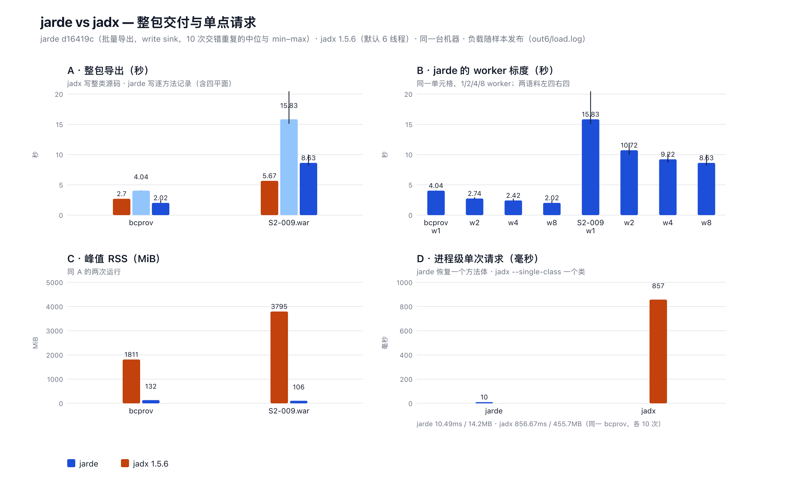

# jarde：把「已证明的部分」当作反编译的第一类产物

> 发布稿草稿（ASC 形态）· 数据来自 `openspec/evidence/benchmark-d16419c/`，图表复现见文末

反编译一个 jar，你得到的通常是一整份「看起来对」的 Java：语法完整、能编译，值却是错的。
错的地方不告诉你，对的地方也不告诉你为什么对——你只能整份相信或整份怀疑。

jarde 换个单位交付：**一个方法体，加它的四个平面**。每个方法体自带
`content`（有语句 / 仅解释 / 未产出）、`quality`（结构化 / 降级）、`representation`、
以及逐条诊断与拒绝理由。引擎在证不出来的时候**不猜**——它把已证明的部分交给你，
把没有证明的部分连同理由留在原地。所以调用方能问的不是「这段代码看起来对不对」，
而是「这段代码里哪一部分被证明了」。

代价是它不能给你一份漂亮的整文件；收益是每个方法体的可信度是**可核对**的。

## Benchmark



同一台机器、同一轮测量（10 次交错重复的中位与 min–max，逐配置预热）：

| 场景 | jarde `d16419c` | jadx 1.5.6（对照） |
| --- | --- | --- |
| 整包导出，bcprov（2,430 类 / 14,495 方法体） | **2.02 s**（8 worker） | 2.70 s（默认 6 线程） |
| 整包导出，S2-009.war（7,200 类 / 53,247 方法体） | 8.63 s（8 worker） | 5.67 s |
| 单点请求：一个方法体（进程级，10 次） | **10.5 ms / 14 MB RSS** | 857 ms / 456 MB（`--single-class`，一个类） |
| 峰值 RSS，整包 | **73–132 MiB** | 1,811 / 3,795 MiB |

**两者交付物不同**：jadx 写整类 Java 源码（bcprov 2,419 个文件）；jarde 写逐方法记录
（bcprov 19,865 条 / 390.8 MB，含四平面与诊断）。上表是**同一轮的同机对照**，
不是吞吐胜负——按字节算 jarde 的流大 17–44×，按「一个方法体 + 它的证据」算 jadx 没有对应交付物。

正确性门禁（结构与行为两道，600 个抽样方法，把产物贴回类里编译并执行、与原类逐输入比对）：
**421/424 可比方法与原类一致（99.3%）**；11/600 自报结构化但过不了 javac。

## 怎么用

```sh
# 一个方法体，带它的平面
jarde-cli recover --input app.jar --policy plain-jar \
  --class-name com/example/Main --method-name run --descriptor '()V' --format json

# 整包导出（流式 JSONL：header → class_prepared → method → class_end → final）
jarde-cli export --input app.jar --output out.jsonl --jobs auto

# 先看一个类里有什么，再决定恢复哪个方法
jarde-cli list-classes --input app.jar --format json
jarde-cli list-members  --input app.jar --definition "$DEF" --format text
```

从源码构建（Rust, `cargo build --release -p jarde-cli`）或按
[`openspec/benchmark-protocol.md`](../openspec/benchmark-protocol.md) 的冻结 SHA 复现本次测量。

## 方法（口径与限制）

- **语料**：vulhub checkout 的 12 个 artifact（3 jar + 9 war），逐字节 SHA-256 校验；
  本图表用其中两个：`bcprov-jdk15on-152.jar`、`S2-009.war`。
- **形状**：协议 C/D 臂 = 整 scope 批量导出（一次操作交付整包），三档 sink（discard/encode/write）×
  1/2/4/8 worker，每格 10 次独立交错重复，逐配置预热；240/240 样本 `exit=0` 且交付计数逐项一致。
  「每个方法一次请求」是历史形状，其数字属另一个 SHA，**不与本表混读**。
- **负载**：随机器的 1 分钟负载采样一并保留；page cache 初态未控制（只做逐配置预热），
  因此时间列是**形状证据**，不是稳态收益。
- **未测**：零容量 store 与超大类倾斜（CLI 未暴露 store 配置）；导出流的证据选择未作对照臂。
- **诊断码**：`resolution_definition_unbound` 在 S2-009 的 298 个方法上出现，原因是这些类在
  两个容器里各有一份（`commons-logging-1.1.1.jar` 与 `commons-logging-api-1.1.jar`）——
  引擎拒绝在被遮蔽的定义上建立运行时语义，**不是恢复失败**。
