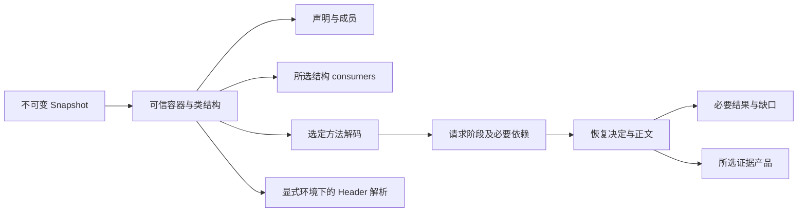

## Context

动机与交付范围见 [proposal](proposal.md)，行为要求见 [demand-driven-results](specs/demand-driven-results/spec.md)。本文保留代码观察固定在 `9a2f4ce` 的设计基线；下文的“当前缺口”描述当时的输入，不代表今天仍未实现。D0–D5 已按 [tasks](tasks.md) 的 32 项交付，实际实现、验证与保留边界以 [verification](verification.md) 为准。现有分层、物理身份、预算、验证等级和保守恢复规则继续适用。

### 设计基线时可复用的能力与缺口

| 层 | 已存在的能力 | 本轮需要补齐的边界 |
| --- | --- | --- |
| reader | `PreparedClassRead/PreparedClass`、可信 digest、成员 locator、共享 CP/Header、唯一 body decoder、活动容器 handle | 普通入口仍有 bind 后重读、直接 driver/callee 重读；跨消费者必须传递已有事实 |
| query | `ConsumerSchema`、结构关系、完整查询身份和 cursor | `ProviderScan::collect` 先收集范围，`scan_units` 先构造整个 unit 的结果，再分页；续页重扫边界 unit |
| jvm | `MethodAnalysisRequest.stages`、固定依赖表、report 与 `MethodIr` 分离 | 沿用这些边界；不增加第二个 planner 或全程序模型 |
| java | 有类型/effect 前提的恢复、origin、稳定命名、source map 与逐规则记录 | `RecoveryRequest` 没有 evidence 选择，`RecoveryReport` 固定拥有全部详细表 |
| facade | `class_view.bodies`、目标选择、独立分析/恢复、bulk/class-source prepared 路径 | 普通组合操作的共享准备未完全贯通，`RecoveryPresentation` 是事后投影，不减少明细构造 |

对应源码：[prepared](../../../crates/jarde-reader/src/prepared.rs)、[query 执行](../../../crates/jarde-query/src/xref/mod.rs)、[stage 请求](../../../crates/jarde-jvm/src/ir.rs)、[MethodIr](../../../crates/jarde-jvm/src/method_ir.rs)、[恢复报告](../../../crates/jarde-java/src/report.rs)、[facade](../../../src/facade.rs)。`MethodAnalysisReport` **没有**序列化全部 CFG/Frame/SSA；这些表位于独立 `MethodIr` payload，不把已有分离误报为待建能力。

## Goals / Non-Goals

**Goals:** 同一事实只有一条解码/分析实现；选择真正限制工作；普通恢复交付必要结果，详细证据独立选择；后续追问能复核相同产物；返回结果、临时工作集和显式保留均有边界；每项有反例和工作计数。

**Non-Goals:** 新公共 Session、任意字符串查询语言、任意 pass 重排、全局后台索引、全程序 IR、跨请求必命中、任意局部/跨方法语义切片、自然语言总结、通用子类型推断、协议实现、线程池/总账性能重写。现有 bulk 调用者只适配证据选择；其调度、活动容器交接和背压仍由原 change 拥有。

## Decisions

### 1. 信息价值由当前问题决定

一份信息值得进入当前结果，是因为它能定位目标、回答问题、限制结论或支持当前核验。算法需要使用某事实，并不意味着调用方每次都需要取得它的完整副本。

| 问题 | 交付的必要事实 | 必要计算 | 下一步才展开 |
| --- | --- | --- | --- |
| 目标在哪里 | 物理候选、声明名/签名、来源、歧义与已查范围 | 定向发现、声明确认 | 成员及 body |
| 类有哪些成员 | 声明、字段/方法 descriptor、flags、明确的表完整性 | Header/member walk | 选定 body、额外元数据 |
| 哪里使用了符号/常量 | 方法身份、BCI/metadata 位置、operation、符号与 derivation | 所选 consumer、必要字节验证 | 声明解析或其它明确关系 |
| 方法做了什么 | 正文、content/quality 等语义平面、局部拒绝/停止 | 该方法恢复所需依赖闭包 | 规则明细、映射、读取轨迹 |
| 某处为什么这样恢复 | 该处规则前提、来源、缺失事实和映射 | 必要语义事实、所选证据物化 | 更大证据范围 |
| 某值由哪些定义影响 | 后续能力，应另立局部数据流查询契约 | 有界 CFG/SSA 及指定依赖 | 跨方法闭包；本 change 不实现 |

CP occurrence、实际 consumer use、解析声明和可能分派是不同事实，不通过“详情级别更高”自动相互升级。事实读取、dialect 支持、runtime selection、verification 和源码恢复同样保持独立。

### 2. 四个选择轴，沿用现有入口

范围、事实类别、分析强度、证据深度相互独立。前三者尽量由 `ClassRef/BodyRef`、query relation/consumers、分析 stages 和 analyze/recover 的已有区分承载；本轮仅补充缺失的恢复证据选择。调用方不必手工计算依赖，由现有固定表补齐前置阶段。

不采用单一 `level=1..5`：它会让“全部调用位置、零源码”和“一小段源码、完整来源”难以表达。不采用任意 JSON 字段路径：字段过滤不能决定是否可省略计算，而且会把内部对象布局变成公共查询语言。

下图表示允许的依赖，不表示每次必须走完整条链：



Query 不通过恢复结果反推字节码关系；详细证据选择不决定恢复规则是否执行。

### 3. 必要结果是语义契约，不是固定字数摘要

必要结果保留目标/请求含义、实际答案、适用的独立平面、真实 execution/coverage、核心缺口和生效配置。当前完整 `Limits/UsageSnapshot` 的公共承诺保持；本轮不为了缩短数字表而重写预算协议。共同身份与配置在所属 operation/class/method 上表达一次即可，但不能省略能区分来源的维度。

核心缺口包含：版本范围内的 `code`、物理方法/成员、BCI 范围或 metadata 位置、影响的事实/区域、已知缺失条件。可读 message 保留一次；完整推导轨迹归详细证据。重复原因可以分组，但每个受影响位置仍可定位，达到额度时按真实停止返回，不能以聚合隐藏位置。

区域拒绝目前有一部分只在正文注释和规则表里。本轮在**原来作拒绝决定的站点**提取核心缺口，不能再解析 `// @bytecode` 文本推回事实。核心缺口与 diagnostics 使用现有原因词汇、位置和 severity；是否映射为现有 `Diagnostic` 由字段适配决定，禁止另建一套冲突代码表。`rule details` 关闭后，核心缺口依然存在。

没有 body 是声明事实；未检查、未知数量、未请求、不支持和检查后为空都有不同含义。`produced()` 只表示交付产物，不能替代 `content`。`execution=Complete` 不代表语义等价、可编译或搜索了整个 universe。

### 3.1 同名类：物理身份与显示标签

沿用 `PhysicalDefinitionId` 和 `PhysicalMethodId`，不为短显示名再发明一套身份。例子中的后缀仅为示意：

| 可读标签 | 可展开的物理来源 | 请求实际使用 |
| --- | --- | --- |
| `com/example/Foo@a91f` | `app.war!/WEB-INF/lib/a.jar!/com/example/Foo.class`，保留各层 entry ordinal | 完整 snapshot、容器链、entry/variant 与 class 字节身份 |
| `com/example/Foo@b204` | `app.war!/WEB-INF/lib/b.jar!/com/example/Foo.class`，保留各层 entry ordinal | 另一完整物理身份；即使字节相同也不能被上一项覆盖 |

名称回答“哪个符号”，物理身份回答“哪一份输入定义”，内容摘要回答“字节是否相同”，运行视图回答“给定环境选中哪一份”。路径本身也不能替代 ordinal，因为 ZIP 可以有同名 entry。方法增加原始 name/完整 descriptor；重复成员记录还需要 ordinal，不能把不合法但可检查的重复记录静默折叠。

短标签是可选显示派生值，不作为核心 selector，也不保证跨 snapshot 稳定。如果调用方展示 `class@short`，后缀必须派生自完整物理身份，在当前展示集合检查冲突并按需扩长，原始名字中的分隔符按已有 display 规则转义；不能仅取内容 digest，也不能通过拆分标签恢复请求身份。核心结果提供已有类型化身份与来源即可，无须增加别名注册表或新的解析入口。

同名候选在尚未声明选择环境时全部保留并报告歧义；已有显式 runtime selection 可以选定一个，但不能删掉物理视图中的其它候选。共享相同字节的解析事实时，绑定 origin 的记录仍属于各自物理定义，不共享已经绑定到另一来源的报告。

全量计数分开记录已观察的物理定义数、不同声明符号数，以及已声明运行视图实际选中的定义数；尚未查全时总数未知，不为了得到准确分母额外全扫。S2-009 的同名多来源盈余按此保留；与其它工具比较时统一范围和选择政策，不能用按名字去重来制造类数相同。D10 必须覆盖“同名不同字节”“同字节不同来源”“重复 entry”“重复方法签名”四种输入；显示标签若未实现，不影响完整身份与证据验收。

### 4. 恢复证据的类型化选择与默认值

以下为目标类型轮廓，命名可在同等契约下调整，不是已发布代码：

```rust
// 添加到现有恢复请求；不新建通用 Request/Session 框架。
struct RecoveryEvidenceRequest {
    kinds: BTreeSet<RecoveryEvidenceKind>,
    driver_bci_range: Option<BytecodeRange>, // 当前方法 [start, end)，None 为全方法
}

enum RecoveryEvidenceKind {
    SourceMap,
    RegionDetails,
    RuleDetails,
    NameDetails,
    ReadDetails,
}
```

`essential()` 是空集合，作为普通恢复默认；`all()` 是明确选择所有类别和全方法范围。第一个版本不增加每条规则的任意表达式过滤器。BCI 选择只过滤证据产品，不承诺只分析那几条指令；控制流、类型和恢复仍可能需要整个目标方法。

返回结果对五个类别保留固定大小的选择/状态清单，明确区分 `NotRequested`、`Complete`（允许空）、`Partial`、`NotPerformed`；不支持输入通过明确错误回答。复用已有状态与停止类型能表达的部分，不建设独立 execution 系统。清单和实际可选 payload 必须一致；`None` 或空 vec 单独不承担状态语义。

| 现有信息 | 默认必要结果 | 选择后的详细产品 |
| --- | --- | --- |
| text、representation/content/quality、编译/验证平面 | 保留 | 不产生第二份正文 |
| 实际拒绝、语义诊断、停止及未完成范围 | 保留可定位事实 | RuleDetails 增加前提/参与者/完整理由链 |
| origin | 内部恢复及核心位置保留 | SourceMap 给出全文或局部文本段映射 |
| regions | 保留影响正文解释的局部缺口 | RegionDetails 给出完整区域记录 |
| lambdas/concats/accessors/bridges/news/fields/enum_switches/init | 规则决定始终执行 | RuleDetails 物化现有记录，包括被拒候选 |
| 变量/成员名字 | 正文和必要的非法名字限制保留 | NameDetails 展开原始名、别名、作用域依据 |
| 依赖读取 | 必要缺失与绑定结果保留 | ReadDetails 展开 callee facts 与完整读取证明；HeaderRead 摘要仍属于原 analysis 报告，不以选择重复复制或削减该摘要 |
| 完整 analysis report、独立 MethodIr payload | 沿用现有分析 API | 不复制为新的恢复专属 IR |

BCI 范围语义：选择与 driver 范围相交的记录，附带解释该记录所需的 origin 闭包。复合表达式的父记录允许因相交被包含，但不得借父记录递归展开所有无关兄弟记录。callee 的同数值 BCI 不参与 driver 过滤；callee 来源作为所选记录的证明保留完整身份。`[x,x)` 在指令边界（含 Code 末尾）为合法空选择；空 kinds 配合 `Some(range)` 是无意义组合，无论区间长度都应拒绝；反向范围、越过 Code、非指令边界和无 Code 的方法范围请求明确拒绝。范围需读取才能验证时费用计入本请求。

### 5. 先形成可信产物，再物化可选证据

把规则内部计划和公开审计记录解耦：现有 `Plan/Claim` 等前提不由 evidence 开关控制；仅对外明细的 clone、长理由拼接和 vector 构造受选择控制。实施前逐字段标注“算法输入/内部计划/必要结果/可选明细”，测试每个关闭分支没有删除前提检查。

执行顺序：

1. 校验请求，取得可信类事实与选定方法。
2. 完成必要分析、恢复决定和正文。origin、类型与 effect 仍完整参与。
3. 提交正文、必要语义平面、核心缺口与产物绑定信息。
4. 在同一预算的剩余额度内物化所选证据，随后释放借用的计划/AST。

默认路径的 emitter 不拥有完整 `Vec<Segment>`。完整或局部 source map 可以在正文提交后，以同一个 emitter 的计数/映射 sink 重放已决定的 AST：复用格式化实现，计算文本偏移，不重新跑 reader/IR/恢复规则，不再复制第二份正文。两种 sink 的偏移和正文身份必须有一致性门禁。未来若合并两遍可保持同样的提交/停止语义，可以独立优化；首版不以单遍为由把可选证据失败变成丢失正文。

可选证据耗尽总预算后立即停止，不继续做“免费”证据或重新恢复。已经提交的正文仍有效，整体 execution 非 Complete，所请求证据各自标明完成前缀。必要正文还没提交便停止时，维持现有诚实停止与清理语义。

### 6. 证据追问绑定确切文本，允许有界重建

恢复结果提供由可信读取与当前恢复生成的产物绑定值；调用方提供的值只是待核对标识，不能作为缓存命中的可信摘要。绑定所需维度复用现有身份：snapshot/PhysicalDefinitionId/PhysicalMethodId、必要的 MethodOrdinal、EnvironmentIdentity、引擎与 recovery/schema 版本、RecoveryProfile、命名/输出配置，以及确切 UTF-8 正文的摘要。复用既有 digest 算法和规范化规则，不引入新 ID 服务。

普通首次恢复没有“预期旧产物”；展开旧文本证据时，调用方把旧绑定作为 `expected_artifact` 连同明确 evidence 选择交给同一恢复管线。当前 schema 可在恢复请求上增加该可选字段，不能只靠方法签名推断产物一致。绑定中不放 elapsed/usage/证据选择，因为它们不决定足额正文；预算导致正文变化时由正文摘要检出。

首版不保留持久 AST/MethodIr，也不引入证据句柄注册表。相同 snapshot 的底层事实仍可由已有 store 复用；否则在新请求预算内重建。只有重建配置与正文身份匹配才交付可以附着到旧文本的映射；错误码如 `evidence_artifact_mismatch` 按既有版本范围登记。预算不足回答真实停止，不能输出碰巧同 BCI 的新映射。

新请求的生效配置、实际费用和当前 execution 始终归新请求；证据不能改写旧报告的执行历史。已核验的声明、指令、正文不会因多展开一项明细而改变；更大的范围或更强关系分析产生的新结论按自己的范围发布。

### 7. 同一操作内，一次可信准备，多消费者读取

采用现有 `PreparedClassRead` 拥有 backing、`PreparedClass<'_>` 在局部借用的生命周期。选择结果向下交付可信 read/facts，而不是交付 identity 后让下一层重新查找。避免创建同时拥有 backing 又自引用 parser 的新公共对象。

```text
trusted read (owns backing + active facts)
  -> prepared class (borrows read; shares facts handle)
       -> declaration/member view
       -> selected body decoder
       -> driver analysis
       -> same-class callee consumer
  -> drop consumers -> drop preparation -> release read
```

名字选择可能检查多个候选，这些是必要搜索成本；所选定义确认后，不能因 prepare 再读同一字节。未选候选不长期驻留。零/多/未完成候选继续按现有 Missing/Ambiguous/Incomplete 契约返回，重复成员仍使用多值 locator，不取 `.first()` 代替歧义处理。

`class_source` 有 body 时当前断言两次 ClassHeaders/ClassBytes，目标是消除已选定义的第二次物化；`class_view` 已共享字节，下一步共享 parser/locator，避免每个 body 重新 `Class::new` 和成员定位。直接 `recover_method` 的同类 callee 读取同一 preparation。环境绑定仍在原检查点执行，不能因物理读取可信就跳过 loader/profile；必要的其它 Header 按真实 reason 计费。

只请求声明时允许准备结构索引但不解码 Code。跨独立请求未保留 facts 时可以重新准备，不把操作内“一次”误写成 snapshot 终生“一次”。不为声明列表默认长期保留全部类的完整 facts。

### 8. 增量查询：provider、consumer 和结果收集都可停止

现有 `ScopeCursor` 只输出 class，query 还涵盖 resource；不能直接把查询范围缩成 `.class`。在 reader 复用物理 entry 遍历底座，将 class-only 过滤留在 bulk；结构 query 消费 entry 事件。目录验证、nested entry 的必要解压/CRC 仍完整计费，按需不等于任意 ZIP 字节随机读取。

query 顺序维持当前容器/entry 物理顺序、固定 consumer 子顺序和 consumer 内位置顺序。每个 consumer 通过可停止的 item visitor 交付，不再先收集 `unit_items` 的所有匹配。调用方已有 `max_items=0` 仍表示无页限制、但预算有界。页满即停止后续消费者和后续 entry，不为准确预知“下一条一定有结果”而继续扫描；`has_more` 保守表示尚未到达范围末尾，续页可以合法为空。

同一 unit 的 class/backing、CP、member locator 在消费者之间复用；code 与 bootstrap 复用同一边界解码底座，未请求的 consumer 入口立即返回，不解码其专属属性。类型引用/资源查询的过滤不能仅凭 CP 未命中排除其它已请求标准位置。

游标由“entry + 匹配条数”演进为结构位置：容器 origin、entry ordinal、consumer 类别、成员/attribute ordinal、BCI 或 metadata/resource 内位置、同一位置产出的下一项序号，以及必要的 traversal resume 状态。序列化不包含内存指针和整个 IR。嵌套遍历可用有界祖先位置链重建，不保存全部后续 entry；复用当前 schema 身份绑定并升级版本，旧版本显式拒绝。

游标是未信任输入：先核对 snapshot、target、relation、scope、schema，再在预算内验证位置存在及边界合法性。不能让伪造位置将未扫描前缀记成已经证明的 coverage。当前页 coverage 只声明本次实际检查范围，不能因“带着旧游标”继承未经检查的完整性。仅因页满正常结束时，该页 execution=Complete，整体范围 coverage 未完成；不要把页面上限编码成预算终止。

无保留的进程/请求允许重新验证目录、CP/布局、Code 定位前缀等必要底座，实际费用必须记录；验收禁止的是重新构造已发布匹配结果并丢弃整个前缀，而非承诺零物理重读。可用现有验证 locator 跳到 consumer 位置；若某底层解码必须重放才能可靠确认位置，应只重放最低事实，并用计数区分重新检查与重复产出。

损坏后缀在被访问前保持 Unknown，不提前发布后来才知道的错误；续页到达时发布该诊断。完整拉尽后的有序事实与相同身份的完整扫描一致；逐页 execution/coverage 的组合按实际范围比较，不要求过去页面预知未来诊断。声明解析和 dispatch 入口不在本轮更改关系语义。

### 9. 预算、保留和交付的边界

仍使用同一请求 Budget、取消与终止词汇。必要计算、可选证据记录、证据重放和输出全部计费；不得给证据创建一个无上限或重置过的预算。关闭证据减少的是实际费用，不能虚构“完整证据已做过”的 usage。

区分三类数据：当前消费者必须持有的可信事实；当前方法必需的 IR/AST；显式有界 store 选择保留的可复用 facts。方法完成后不因产物带 identity 就保留 IR。取消后不再派新工作，临时计划与嵌套表达式的释放也必须无递归 abort。

bulk 已有总账与拥有容量口径继续覆盖新可选 payload；完整证据导出显式使用 `all()`，容量权重必须按实际持有数据重新核对。活动容器 handle 随 worker 任务交接归 bulk 原 change，不能让本轮另写一个 scheduler 或依赖缓存命中掩盖该缺口。

任何有限 output/result 上限都无法保证任意大的必要结果必然交付。必要缺口数量超过额度时明确停止，不能通过删掉诊断获得 Complete；CLI 文档停止报告的既有额度问题仍是独立债务。

### 10. 语义、证据和执行的比较口径

完整同配置重复结果：继续只排除既有允许的 elapsed 差异，不能增加宽泛白名单。不同 evidence 选择的足额结果：比较正文、身份、恢复/拒绝、所有适用语义平面与核心缺口；证据选择/状态、实际费用和记录数量分别核对。不同 cache 路径：遵循既有 direct/cold/warm 语义比较契约。

局部证据应等于相同产物的完整证据按定义过滤并补足必要 origin 后的结果。比较包括排序、父/子关系、跨方法来源和 GeneratedWithoutOriginalSpan，不能只比较记录总数。

同一个紧预算下，简单模式完成而详细模式停止是合法差异。真实 wall-clock 取消位置不稳定，采用受控计数/屏障停止验证前缀与清理；墙钟实验另报响应时间。`source map 关闭` 不得成为运算、boolean、异常或副作用回归的免责项。

### 11. 源码事实与性能观察的当前结论

`642e49f` 已共享 prepared CP/Header Arc，不再把深拷贝当作未修项。serial slot 清理、`this`、总账接线等以最新代码为准；其它任务表的勾选不能自动代替本轮准入核验。

已有 [cost attribution](../add-parallel-bulk-recovery/evidence/cost-attribution.md) 的 discard 单次样本中，多 worker 没有提速；它只能排除文件写出作为唯一原因，不能排除内部有序等待。`Budget::charge` 的 poll/charge 都访问共享总账，锁竞争是待测假设，不是本轮已证明瓶颈。该优化归父性能专项，不纳入本 change 的完成条件。

恢复/详细证据的交付成本和完整导出吞吐分别测量。Rust/JVM 语言选择不作为性能证据；少交付字段也不作为同产出算法提速证据。

### 12. 所有权、库复用与不采用的方案

| 选择 | 理由与限制 |
| --- | --- |
| 继续 noak/rawzip/现有 digest、serde 与 reader decoder | 已有准入与测试，所需变化是消费生命周期和结果构造，无新增库收益证据 |
| 现有 Arc/facts store + 局部借用 | 能表达可信 backing 与消费者，避免全局 Session 和自引用公共结构 |
| 固定类型 evidence set + BCI 选择 | 能覆盖已存在报告，不引入脚本查询、反射序列化或插件总线 |
| 同 emitter 的文本/映射 sink | 共享拼写逻辑；验证额外遍历成本，避免第二份正文和另一套 formatter |
| 查询结构 cursor | 绑定稳定物理/消费者位置，避免跨请求永久保存 IR 和只按匹配序号重扫 |
| 不持久缓存整份 recovery report | 报告包含当前 usage、停止与证据选择，复用整个报告容易伪造新请求工作与完成状态 |

若后续提出新依赖，另按 [依赖准入](../../dependencies.md) 记录版本、维护状态、许可证及现有库缺口；本设计不以自研本身作为架构优势。

### 13. 可独立提交的实施边界

| 阶段 | 交付 | 前提与所有权 |
| --- | --- | --- |
| D0 | 冻结当前事实、反例和必要/可选字段清单 | 只立门禁；不改语义 |
| D1 | 请求选择、必要结果与 artifact/evidence 状态 | 本 change；显式 all 暂维持旧明细路径 |
| D2 | 普通入口 prepared 交接 | 本 change；不依赖证据优化，不重做 bulk 任务 |
| D3 | 可选证据物化、局部选择、产物绑定重建 | 依赖 D1；保留全部原语义门禁 |
| D4 | 增量 provider/consumer 与新 query cursor | 与 D2/D3 可分别实施；复用 reader 生命周期，不改变关系含义 |
| D5 | 同配置、跨选择、停止/释放和实际工作负载验收 | 汇总 D1–D4；已知正确性缺口先独立关闭或明确阻止相应发布主张 |

每阶段结束才勾选对应任务。若拆成多个实施 PR，共用本 change 的验收编号；若拆为独立子 change，先迁移实现所有权与任务引用，不重复计完成。

### 14. Acceptance Map

| ID | 外部判据/受控 fixture | 必须能证伪的错误实现 |
| --- | --- | --- |
| D01 | 成员只读：0 body/IR/recovery；结构引用：0 resolver/IR/recovery；确切方法与依赖集合可对账 | 先全量再过滤、为小请求自动预取 |
| D02 | bind + prepare + driver/callee 共享选中类；明确身份 class_source 一次物化；none/zero store 对照 | identity 交接后重复读；把两次 ClassHeaders 固定为目标 |
| D03 | Essential/All 充足预算正文逐字相同，完整模式全部旧证据仍在 | 用 detail 控制规则是否运行、少输出冒充语义通过 |
| D04 | 关闭类别的明细拥有型记录构造为零；局部选择等于完整证据投影 | 构造完整表再截断/序列化隐藏 |
| D05 | ExplanationOnly、局部拒绝、无 Code、未知分母、预算停止各有真实状态与位置 | 空集合/produced/0 of 0 掩盖未知 |
| D06 | 正文提交后证据停止保留正文；提交前/后取消均清理，无后续工作 | 丢产物、免费补证据、整体假 Complete |
| D07 | 丢弃临时事实后可重建匹配证据；更换规则/格式/内容明确 mismatch | 仅按签名或 BCI 绑定；无限保留 IR |
| D08 | 密集命中第一页不产出后续 consumer/unit；坏后缀不提前诊断；完整续页等于完整扫描 | provider 全收集、unit_items 全构造、匹配序号重扫 |
| D09 | 更换 target/relation/scope/schema 拒绝旧 cursor；允许只改页大小/预算 | 使用无身份 cursor 或伪造前缀覆盖 |
| D10 | 重复 origin 与重复成员 ordinal 独立；caller/callee 同 BCI 的证据不混淆 | name/hash 去重、locate_method().first() |
| D11 | 继续、换目标、放弃、cache 容量拒绝和取消后临时所有权释放；bulk 权重适配 | 将产物 identity 变成隐藏驻留根 |
| D12 | 首次结果/全序列、构造数/输出字节/峰值/时间独立测量；两种证据模式分别对照 | 将吞吐、warm p50、计数或小输出偷换为算法收益 |

这些测试优先使用仓库可再生成的小 fixture。单次请求、连续请求、弃用序列、密集/稀疏命中、大单类和 nested 多来源分开；必要性能实验按既有协议至少十次独立交错样本，尾延迟需另定足够样本量。新增仪表在 harness sidecar 或 test-support，不能改变领域 fingerprint。

### 15. 独立正确性债务与后续分析能力

| 项目 | 已确认现状 | 建议最小修正与验收 | 本 change 的关系 |
| --- | --- | --- | --- |
| 数组参数槽宽 | `class_source::descriptor_type` 令 `[J/[D/[[J` 沿用元素宽度 2；`f(long[] xs,int n){return n;}` 无调试信息时产物参数为 arg2、正文引用 arg1，javac 拒绝；int[] 对照正常 | 独立修复数组槽宽；再收敛 reader 的结构 descriptor 事实，保留原始名字/维数，frame 计算槽位，java 负责合法拼写；覆盖实例/静态、混合 long/double、调试开关及执行对照 | 已知缺口不可被默认精简隐藏；不在本轮 evidence 改动里夹带通用类型重构 |
| append(int) 消费 char（T5） | `'A'` 应得 `65!`/`x65`，当前 `A!`/`xA`，两边可编译 | 保留 Concat 片段；对齐消费位置类型与表达式类型，明确转换节点；首/后片段、参数/字段/调用结果和副作用执行对照 | 先独立闭环再作“同质量加速”发布；见 [现有反例](../../completion-review.md) |
| 活动容器跨 worker 交接 | cursor 提供 handle，bulk 队列仍需验证离开容器后待执行任务持有它；不以 CLI store 命中代替 | 多 nested、延迟首 worker、none/zero/小容量 gate；由 bulk 任务负责 | 依赖已有 API，无新 scheduler |
| 精确局部/跨方法数据流查询 | 具有内部 SSA，不等于有可用查询产品 | 另立范围、异常/别名/调用边界和 Unknown 的查询契约 | 明确延期，不因本文问题表而自动接管实现 |
| >255 维、任意深表达式、通用可赋值性、CLI 文档停止 | 既有已记录边界 | 分别按原边界/独立 change 验收 | 不标成随渐进结果已修复 |

## Risks / Trade-offs

- [证据开关误删恢复依据] → 先分类内部计划与外部记录；Essential/All 执行对照及“去掉前提检查”反例必须失败。
- [两次 emitter 遍历增加完整证据成本] → 复用 AST 和拼写函数，计量全证据耗时/分配；不承诺完整模式一定更快，不为省遍历破坏提交语义。
- [cursor 细化泄漏 parser 内存布局] → 仅序列化稳定物理/语义位置，schema 版本化；不能携带进程内指针。
- [页满后未知后缀改变旧首屏诊断] → delta 明确该可观察变化，完整续页对照和坏后缀门禁保留。
- [内部计划本身很大] → 明细选择只解决部分成本，真实依赖仍计入预算和工作集，不把计划内存排除后宣称整体有界。
- [局部证据要求完整方法分析] → 生效范围与费用分别报告，避免把证据选择说成任意局部 IR 切片。
- [多 change 同时修改报告/facade] → bulk 保留唯一调度所有权；新类型接入时明确全证据选择，完整 fingerprint 与权重门禁一起迁移。

## Migration Plan

1. 记录当前 revision、dirty patch 与原测试基线；保留本文件列明的已知失败，先分配独立修复所有权。
2. 按 D0–D5 提交最小闭环。新证据类型加入时将需要旧详细契约的现有测试/导出明确改为 `all()`；普通恢复默认 `essential()`，不维护双套长期实现。
3. query cursor 提升 schema；旧值明确拒绝，无静默跨版本继续。公共 Rust/serde 变化记录为 breaking，所有 workspace 调用者同步更新。
4. 文档与示例同时说明字段选择、适用性、产物绑定和停止；主 specs 仅在全部所需实现和验收通过后同步归档。
5. 回退以独立提交为单位；不能回退已有正确性修复，也不能在运行中给已停止请求重置预算重跑。若明细优化未证明时间收益，报告功能/工作量改进和未证实的时间结论，不编造倍数。

### 16. D0 的字段角色与计数门禁（1.1–1.3 产物）

实施冻结、逐字段清点与计数见证的完整记录见 [verification](verification.md)。本节只固定清点**分类契约**和 D1–D4 必须遵守的口径；它不改动上文任何决定。

| 角色 | 含义 | 对实现的约束 |
| --- | --- | --- |
| 算法输入 | 算法读取的输入，不是本次运行的产品（`RecoveryRequest::profile`、`MethodIr::facts` 句柄、`MethodFacts`/`ClassMembers`） | 不因证据选择而省略，选择开关不得改变它 |
| 内部计划 | 为产生产物所必需、随本次运行释放的内部结构（规则计划、区域树、AST、`MethodIr` 的表、`NormalFlowView`、`NameTable`…） | 只在需要时构建，不是报告字段；“关闭明细”不得删掉任何前提判定 |
| 必要结果 | 任何选择下都交付：身份、正文、六个平面、execution/coverage、核心缺口与诊断 | 证据选择不得删除、降级或改写 |
| 可选明细 | 只在选择对应证据时物化：`SourceMap` 段表、`RegionRecord`、各规则记录、`aliased_names` | 未选择时不构造、不复制、不保留；`None`/空 vec 不承担状态语义 |

清点结果（字段级表与统计见 verification §6）：`RecoveryReport` 27 字段 = 算法输入 1 + 内部计划 0 + 必要结果 13 + 可选明细 13；规则/区域计划 110 字段 + 它们持有并发布的记录 72 字段全部落在内部计划或可选明细一侧；emitter 与 source map 的 17 字段中 5 个是可选明细（`Emitter::segments`、`SourceMap`、`Segment`）；analysis/callee 报告 55 字段中只有 `MethodAnalysisReport::origin` 与 `CalleeBody::facts` 不在其 API 自己的必要结果一边。

**内部 CFG/SSA 本已与报告分离**：`MethodAnalysisReport` 与 `RecoveryReport` 都没有 CFG、帧、SSA 或块表字段，图与表只在 `jarde_jvm::method_ir::MethodIr`，由 `RecoveryRequest::ir` 借用。D1/D3 的证据选择因此只在同一载荷上选择**物化哪些对外记录**，不新建第二套 IR/AST 模型，也不把已有分离误报为待建能力（字段级核对见 verification §6.6）。

计数门禁（1.3）：`src/d0_counts.rs` 是 test-support 端口（普通构建里是空钩子、无读数 API），只保存 5 个 `u64`，不进任何报告、停止记录或 fingerprint；D1–D4 的验收按 [verification](verification.md) §7 的冻结读数与变异口径执行。数组参数槽宽与 T5 反例只在本文件中保留为独立债务（§15），不因 D0 记录被标成已修复。
